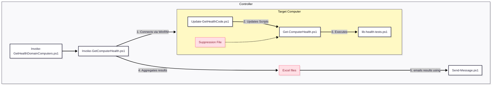

# GetComputerHealth
An extendable PowerShell framework designed to automate server and workstation health monitoring. It operates on a controller-agent model using PowerShell Remoting to execute more than a hundred tests (see List of tests below) on each computer.

# 1. Architecture Overview

The toolkit operates on a **Controller-Agent** model (though agentless via PowerShell Remoting). You run the orchestration script on your management machine (the Controller), which executes tests on your servers/workstations (the Targets), then aggregates the results into Excel reports and emails them.

## Relationship Diagram



---

# 2. Script Components Breakdown

This section explains the role of each file in your `C:\it\bin` directory.

## A. The Orchestrators (Run these)

These are the scripts you actually execute.

* **`Invoke-GetHealthDomainComputers.ps1`**
* **Role:** The "Easy Button" wrapper for testing all domain servers.
* **Function:** By default it scans all computers running Windows Server OS, but you are encouraged to edit it to add some extra hosts and exclude others.
* **Usage:** Run this manually or schedule it run e.g. daily via the SYSTEM account to check the whole domain.


* **`Invoke-GetComputerHealth.ps1`**
* **Role:** The Engine / Orchestrator, will test the local host by default or the computers you specify.
* **Function:** It manages the workflow:
1. Connects to the local or one or more remote computers.
2. Triggers the self-update on the remote target.
3. Runs the health checks remotely.
4. Collects outputs, saves them to Excel format (`C:\it\temp\`), and emails "Notable" (non-success) messages.


* **Key Parameters:** `-Computers` (list of targets), `-ExcludeServers`, `-Hide` (filters output levels).


## B. The Worker (Runs on Targets)

These scripts run locally on the servers being checked.

* **`Get-ComputerHealth.ps1`**
* **Role:** The Local Runner.
* **Function:** It loads the test library and executes the tests. It handles the logic for **Whitelisting** (suppressing known failures) and nice, colored console output.
* **Usage:** Can be run interactively on a specific server for troubleshooting (`$results = Get-ComputerHealth.ps1 -OutputConsoleMessages`).


* **`lib-health-tests.ps1`**
* **Role:** The Logic Library.
* **Function:** Contains the actual code for checks like `HealthTest-DiskSpace`, `HealthTest-TimeSyncPolicy`, etc. It does not run itself; it is loaded by the Runner.


* **`Update-GetHealthCode.ps1`**
* **Role:** The Updater.
* **Function:** Ensures the local `C:\it\bin` folder has the latest version of all scripts by downloading them from a central repository. It runs automatically before tests begin.


## C. Utilities

* **`Send-Message.ps1`**: A utility wrapper for sending SMTP emails (configured via `C:\IT\config\Send-Message.conf`).

---

# 3. Admin Guide: Installation

Change the obvious PLACE HOLDERS at the top, and then run:
```PowerShell
# Setup email delivery
$text = @'
{"Server":  "MAIL.SERVER.COM",
"From":  "__pc_name__+FROM@DOMAIN.COM",
"To":  "TO@DOMAIN.COM", "Port":  25, "UseSsl":  false}
'@
($text -replace '__pc_name__',$env:COMPUTERNAME)|Out-File "C:\it\config\Send-Message.conf" -Encoding utf8 -Force

# Create C:\IT\bin and download installer/updater script
mkdir C:\it\bin -force > $null; 
Invoke-WebRequest -useb "https://raw.githubusercontent.com/ndemou/GetComputerHealth/refs/heads/main/Update-GetHealthCode.ps1" -OutFile c:\it\bin\Update-GetHealthCode.ps1

# Download all other scripts & installs some modules
c:\it\bin\Update-GetHealthCode.ps1 

# Test email delivery
C:\it\bin\Send-Message.ps1 -Subject "1st test from $($env:computername)" -ConfigFile C:\it\config\Send-Message.conf -Verbose

# Perform your first health test manually
c:\it\bin\Invoke-GetComputerHealth.ps1

# Probably run a few whitelisting commands...
#...

# Schedule to run automatically every day
. c:\it\bin\helpers-processes.ps1 # imports the command New-ScheduledTaskForPSScript
New-ScheduledTaskForPSScript -ScriptPath C:\it\bin\Invoke-GetComputerHealth.ps1 -ScheduleType Daily -Time 07:12
```

# 4. Admin Guide: Common Tasks

## How to Run a Health Check for one computer

Open PowerShell as Administrator and run:

```powershell
C:\it\bin\Invoke-GetComputerHealth.ps1

```

* **Result:** This will scan the computer you run it on, save an Excel report to `C:\it\temp\`, and email you any "Notable" issues (Notices/Warnings/Failures).

## How to Run a Full Domain Health Check

Open PowerShell as Administrator and run:

```powershell
C:\it\bin\Invoke-GetHealthDomainComputers.ps1

```

* **Tip:** Edit it to add non-Windows Server computers or exclude some Windows Server ones.
* **Result:** This will scan the computers you specify, save an Excel report to `C:\it\temp\`, and email you any "Notable" issues (Notices/Warnings/Failures).

## How to Suppress a False Positive (Whitelisting)

By default the health tests will mark any deviation from a pristine Windows Installation as an issue (e.g. a service you installed, a member of Administrators you added, or an extra TCP port listening). If that's normal for your installation, you are expected to whitelist it so it stops alerting you.

1. **Identify the whitelisting command:** Look at the Excel. Every message has a column with a Whitelist command.
2. **Apply Whitelist:** Run the whitelist command on the **target machine** (or via remote shell).

* **Tip**: The Excel file is convenient but not necessary to whitelist a message. Look at the help of Get-ComputerHealth or the examples in an Excel file.
* **What happens under the hood:** This adds the signature to `C:\it\config\Get-ComputerHealth.sigs-to-suppress.txt`. Future runs will mark this error as "Suppressed" and will not consider it "Notable".


## How to Check a Single Server Interactively

If you want to debug a specific server, log in to it and run:

```powershell
C:\it\bin\Get-ComputerHealth.ps1 -OutputConsoleMessages -OutputObjects -Hide DIP
```

* **Tip:** `-Hide DIP` hides **D**ebug, **I**nfo, and **P**ass messages, showing only Notices, Warnings and Failures.
* **Tip:** `Get-ComputerHealth.ps1` provides a lot of useful arguments. Look at its help or explore them by dash-tabing your way around.

## How to Add Custom Tests

You do not need to modify the core `lib-health-tests.ps1`.

1. Create a folder `C:\it\config\Custom-HealthTests\` on the target.
2. Add a `.ps1` file containing functions named `CustomHealthTest-SomethingDescriptive`.
3. Use `Log-Pass`,`Log-Notice`,`Log-Warning`,`Log-Failure` to report results. Write the messages carefully. If you decide to change them or they include unecessary variable text (e.g. the current date), the signature of the message will change, and any whitelisting you have done will stop working. To include extra or variable text add `-Comment "..."` to any of them.
4. The runner will automatically detect and execute any function starting with `CustomHealthTest-`.

Example script:
```PowerShell
[dc01]: PS C:\Users\ndemou-admin\Documents> cat C:\it\config\Custom-HealthTests\Test-NetworkHealth.ps1
# The following script provides the Test-NetConnectivityToHost/ToNetwork commands
. c:\it\bin\helpers-networking.ps1

function CustomHealthTest-NetworkHealth(){
    Test-NetConnectivityToHost -RespondsToPing:$true -Host SRV1        -OpenPorts 3389,1234
    Test-NetConnectivityToHost -RespondsToPing:$true -Host SRV2        -OpenPorts 3389,12345
    Test-NetConnectivityToHost -RespondsToPing:$true -Host 192.168.0.1 -OpenPorts 22,80,443  # Router
    
    Test-NetConnectivityToNetwork -NetworkDescription "10.0.x.y/16" -KnownHostIps @('10.0.1.2','10.0.3.4','10.0.5.6')
}
```
---

# 5. Directory Structure Reference

| Path | Purpose |
| --- | --- |
| `C:\it\bin\` | Contains all script files (`.ps1`). |
| `C:\it\config\` | Contains configuration files (`Send-Message.conf`) and the suppression list (`Get-ComputerHealth.sigs-to-suppress.txt`). |
| `C:\it\temp\` | Staging area for downloads and location of generated Excel reports. |
| `C:\it\log\` | Stores transcript logs of script execution. |

# 6. List of tests

This is a list of tests as of version 1.3.0. Run `Get-ComputerHealth.ps1 -ListAllBuiltInTests` to get an up-to-date list.

  1. **HealthTest-AdminSDHolderCoverage**: Checks AdminSDHolder applied to protected groups reasonably. OnlyForDomainServers
  1. **HealthTest-ADReplication**: Quick AD replication check for this DC using RSAT cmdlets.
  1. **HealthTest-ADViewConsistency**: Cross-checks AD "view" consistency across DCs (DC list and all FSMO holders).
  1. **HealthTest-AutoStartServicesRunning**: Checks for services set to start automatically but are not currently running.
  1. **HealthTest-BitLockerStatus**: HealthTest-BitLockerStatus
  1. **HealthTest-CertExpiry**: Alerts on soon-to-expire or expired machine certificates (LocalMachine\My).
  1. **HealthTest-ConnectivityToDCs**: Connectivity health check for all Domain Controllers.
  1. **HealthTest-CrashDumpSignals**: HealthTest-CrashDumpSignals [[-Hours] <int>]
  1. **HealthTest-Dcdiag**: Runs DCDIAG (/c /v) and reports any failing tests; classifies basic vs extra tests.
  1. **HealthTest-DcDnsARecords**: Checks for stale/mismatched DC DNS A records vs. AD DC IPs. OnlyForDCs
  1. **HealthTest-DcDnsServerForwarder**: Checks that this domain controller is not using public DNS forwarders.
  1. **HealthTest-DefaultLocale**: Checks if the system default locale (ACP/OEMCP) matches expected values.
  1. **HealthTest-DefenderStatus**: Checks Microsoft Defender signature freshness and reports status.
  1. **HealthTest-DfsDiagTestDCs**: Smoke-tests DFSDIAG /TestDCs output for unexpected lines.
  1. **HealthTest-DfsNamespaceEnumerate**: Verifies DFS Namespace (domain-based) objects enumerate without error. OnlyForDomainServers
  1. **HealthTest-DfsrBacklog**: Flag high DFS-R backlog for a replication group.
  1. **HealthTest-DfsrBacklogSysvol**: HealthTest-DfsrBacklogSysvol [[-MaxBacklog] <int>] [<CommonParameters>]
  1. **HealthTest-DfsReplicationState**: Validates DFS Replication (DFSR) state across replicated folders.
  1. **HealthTest-DhcpDnsCredential**: Validates DHCP DNS update credential account health. OnlyForDomainServers
  1. **HealthTest-DhcpInAd**: Ensures DHCP server presence/authorization sane if role installed. OnlyForDomainServers
  1. **HealthTest-DhcpScopeUtilization**: HealthTest-DhcpScopeUtilization
  1. **HealthTest-DisabledGpoLinksAtDomainRoot**: Detects disabled GPO links at domain root (policy choice). OnlyForDomainServers
  1. **HealthTest-DisksHaveFreeSpace**: Checks if any fixed, removable, or network drives are low on free space.
  1. **HealthTest-DnsClientService**: Verifies DNS Client service is running.
  1. **HealthTest-DnsForwarders**: Validates DNS forwarders reachability and forbids loopback.
  1. **HealthTest-DnsRecursionConfig**: Validates DNS recursion configuration (enabled/forwarders/EDNS). OnlyForDCs
  1. **HealthTest-DnsScavenging**: Checks DNS scavenging/aging configuration (server + per-zone).
  1. **HealthTest-DnsSuffixBaseline**: Verifies key DNS suffix/devolution/registration settings for a small, single-domain AD.
  1. **HealthTest-DnsSuffixMatchesDomain**: Checks DNS suffix for the AD domain. OnlyForDomain,NotForDCs
  1. **HealthTest-DnsZoneReplicationScope**: Validates DNS zone replication scope for AD-integrated zones.
  1. **HealthTest-DnsZoneTransfers**: Verifies DNS zone transfers are restricted. OnlyForDCs
  1. **HealthTest-DomainARecordPointsToDcIp**: Checks that the domain DNS name A record points to at least one DC IP. OnlyForDomain,NotForDCs
  1. **HealthTest-DuplicateSpn**: Detects duplicate SPNs by querying AD directly (no setspn parsing).
  1. **HealthTest-EfsRecoveryAgents**: Checks presence of EFS Data Recovery Agents policy/certs. OnlyForDomainServers
  1. **HealthTest-EventLogMaxSizes**: Ensures event log max sizes meet baseline without reading events. OnlyForDomainServers
  1. **HealthTest-ExploitProtectionBaseline**: Baseline check for key Windows Exploit Protection (system) mitigations.
  1. **HealthTest-FirewallEnabled**: Checks if the firewall service is running and enabled for all profiles.
  1. **HealthTest-GcPlacement**: Checks GC placement (at least one per site or per-domain policy). OnlyForDCs
  1. **HealthTest-GpoVersionConsistency**: Validates GPT vs GPC version numbers for GPO consistency. OnlyForDomainServers
  1. **HealthTest-GpupdatePolicyApply**: Runs gpupdate and validates computer and user policy application. OnlyForDomain,NotForDCs
  1. **HealthTest-GpWmiFiltersNamespaces**: Validates GP WMI filters use namespaces that exist on this host. OnlyForDomainServers
  1. **HealthTest-HotfixBaseline**: Verifies required hotfix baseline is present. OnlyForDomainServers
  1. **HealthTest-HyperVRunningVMs**: Checks if any Hyper-V VMs that should auto-start are not currently running.
  1. **HealthTest-HyperVVMProperties**: Checks running Hyper-V VMs for unexpected property values.
  1. **HealthTest-IisBindings**: Sanity-check IIS site bindings for common misconfigurations.
  1. **HealthTest-InstalledRolesFeatures**: Reviews installed roles/features against policy.
  1. **HealthTest-InterfaceDnsServersUseDcs**: Ensures each interface DNS server list contains only DC IPs. OnlyForDomain,NotForDCs
  1. **HealthTest-IPv6Binding**: Verifies IPv6 binding state per policy (PS5.1-safe).
  1. **HealthTest-IsTPMActivated**: Checks if TPM is activated. OnlyForMobile
  1. **HealthTest-KccConnectivity**: Ensures KCC created inbound connections for every DC. OnlyForDCs
  1. **HealthTest-KerberosEncryptionTypes**: Reports accounts permitting RC4 via msDS-SupportedEncryptionTypes. OnlyForDomainServers
  1. **HealthTest-KrbtgtAge**: Flags stale krbtgt (pwdLastSet age above threshold). OnlyForDomainServers
  1. **HealthTest-LdapSigningChannelBinding**: Ensures LDAP signing and channel binding settings are enforced.
  1. **HealthTest-LocalAcntRequirePass**: Checks if any local user accounts have PasswordRequired set to False.
  1. **HealthTest-LocalAdminsBaseline**: HealthTest-LocalAdminsBaseline [[-Allowed] <string[]>]
  1. **HealthTest-MalwareProtectionFeatures**: Checks if all Microsoft Defender (Malware Protection) features are enabled.
  1. **HealthTest-NetworkInterfaceMetrics**: Checks active interface metrics for sane binding preference. OnlyForDomainServers
  1. **HealthTest-Nic**: HealthTest-Nic
  1. **HealthTest-NltestSiteDiscovery**: Verifies NLTEST /dsgetsite can determine the client AD site. OnlyForDomain,NotForDCs
  1. **HealthTest-NonDefaultShares**: Checks if there are any non-default file or print shares on this machine.
  1. **HealthTest-NonMicrosoftServices**: Reports a warning for any non Microsoft service it finds
  1. **HealthTest-NtdsLogVolumeFree**: Ensures NTDS log volume free space above threshold. OnlyForDCs
  1. **HealthTest-NtdsPathsLocation**: Verifies NTDS.dit and log paths are on intended volumes.
  1. **HealthTest-NtfsDirtyBit**: Check NTFS volumes for the "dirty" bit.
  1. **HealthTest-NtlmHardening**: Checks NTLM hardening and emits an advisory when the default (3) is in effect.
  1. **HealthTest-PagefileSanity**: Checks that a pagefile exists and meets a minimum size.
  1. **HealthTest-PendingReboot**: Detects whether a reboot is pending on this host.
  1. **HealthTest-PreWin2000Group**: Reports members of 'Pre-Windows 2000 Compatible Access' (should be empty). OnlyForDomainServers
  1. **HealthTest-RamPressure**: Snapshot test for low free RAM.
  1. **HealthTest-RdpHardening**: Checks RDP hardening (NLA enabled and cert bound). OnlyForDomainServers
  1. **HealthTest-RecentDiskErrors**: HealthTest-RecentDiskErrors [[-Hours] <int>]
  1. **HealthTest-RecentWindowsScan**: Checks if Windows Defender performed a quick scan recently
  1. **HealthTest-RecycleBinEnabled**: Confirms AD Recycle Bin is enabled.
  1. **HealthTest-ReplicationLatency**: Checks replication latency on schema/config partitions.
  1. **HealthTest-RequiredSrvRecords**: Confirms required SRV records exist in _msdcs.
  1. **HealthTest-RestrictAnonymous**: Checks anonymous access hardening against modern baselines.
  1. **HealthTest-ReverseZonesPresent**: Confirms reverse lookup zones exist for known subnets. OnlyForDCs
  1. **HealthTest-RidManager**: Runs DCDIAG RIDManager and checks for failures or low pool signals. OnlyForDCs
  1. **HealthTest-RodcPrp**: Reviews RODC PRP (allow/deny) presence where RODCs exist. OnlyForDomainServers
  1. **HealthTest-SchanelBaseline**: Basic Schannel hardening**: SSL3/TLS1.0 disabled, TLS1.2 enabled. OnlyForDomainServers
  1. **HealthTest-ScheduledTasks**: HealthTest-ScheduledTasks
  1. **HealthTest-ScheduledTasksLastResult**: Evaluates scheduled task "Last Result" codes on the local host, suppressing informational values, and reports only meaningful warnings and failures.
  1. **HealthTest-SchemaVersionConsistency**: Ensures AD schema objectVersion matches across all DCs.
  1. **HealthTest-ServiceAccountsPwdNeverExpires**: Flags service accounts with PasswordNeverExpires.
  1. **HealthTest-ShadowStorage**: Checks shadow storage presence and size info.
  1. **HealthTest-ShareReasonableness**: Audits SMB shares for broad access and hygiene issues.
  1. **HealthTest-SingleDefaultGateway**: Ensures the host does not have multiple default gateways.
  1. **HealthTest-Smb1Disabled**: HealthTest-Smb1Disabled
  1. **HealthTest-SmbSigningRequired**: Requires SMB signing on the server.
  1. **HealthTest-SoftwareLicensing**: Verifies Windows are Licensed.
  1. **HealthTest-StartupItems**: Scrapes common auto-start locations for rogues.
  1. **HealthTest-Storage**: Performs a comprehensive health check of all local physical disks using Windows Storage APIs.
  1. **HealthTest-SystemScheduledTasks**: Lists SYSTEM-scheduled tasks that are disabled, stale, or failing.
  1. **HealthTest-SysvolAclHygiene**: Checks SYSVOL NTFS ACLs do not grant write to broad principals. OnlyForDCs
  1. **HealthTest-SysvolContentConsistency**: Compares SYSVOL policy tree manifest across DCs (count+hash). OnlyForDCs
  1. **HealthTest-SysvolNetlogonAccessible**: Tests SYSVOL/NETLOGON accessibility across DCs.
  1. **HealthTest-TimeSyncAccuracy**: Measures time offset vs. a time source and compares against thresholds.
  1. **HealthTest-TimeSyncPolicy**: Validates that the host's time sync topology matches AD/NTP best practices.
  1. **HealthTest-TombstoneLifetime**: Checks tombstoneLifetime and links interval sanity.
  1. **HealthTest-TrustsVerify**: Verifies domain trusts and performs netdom /verify.
  1. **HealthTest-UnconstrainedDelegationAccounts**: Finds accounts with unconstrained delegation (excludes DCs by default).
  1. **HealthTest-UnexpectedListeningPorts**: Flags unexpected listening TCP ports; ignores 49152-65535 and notes optional baseline ports (3389, 47001, 593). OnlyForDomainServers
  1. **HealthTest-UnsignedDrivers**: Flags unsigned PnP drivers, ignoring common false positives from core system components.
  1. **  OnlyForDomainServers
  1. **HealthTest-UnusedEnabledAdapters**: Flags enabled NICs that are disconnected (cleanup). OnlyForDomainServers
  1. **HealthTest-UpdateAge**: Flags stale Windows Update posture based on last successful install date.
  1. **HealthTest-VssWriters**: Lists VSS writers and flags non-stable states.
  1. **HealthTest-WinRMListening**: Confirms WinRM is running and responsive.
  1. **HealthTest-WmiRepository**: Verifies WMI repository consistency.
