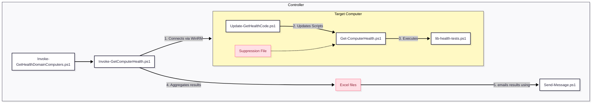

# GetComputerHealth
An extendable PowerShell framework designed to automate server and workstation health monitoring. It operates on a controller-agent model using PowerShell Remoting to execute tests.
Here is a high-level administrator’s guide for the EnLogic Health Check Toolkit. This suite of scripts is designed to automate server health monitoring, handle updates, and generate reports with minimal manual intervention.

# 1. Architecture Overview

The toolkit operates on a **Controller-Agent** model (though agentless via PowerShell Remoting). You run the orchestration script on your management machine (the Controller), which executes tests on your servers/workstations (the Targets), then aggregates the results into Excel reports and emails them.

## Relationship Diagram



---

# 2. Script Components Breakdown

This section explains the role of each file in your `C:\it\bin` directory.

## A. The Orchestrators (Run these)

These are the scripts you actually execute.

* **`Invoke-GetHealthDomainComputers.ps1`**
* **Role:** The "Easy Button" wrapper for testing all domain servers.
* **Function:** By default it scans all computers running Windows Server OS, but you are encouraged to edit it to add some extra hosts and exclude others.
* **Usage:** Run this manually or schedule it run e.g. daily via the SYSTEM account to check the whole domain.


* **`Invoke-GetComputerHealth.ps1`**
* **Role:** The Engine / Orchestrator, will test the local host by default or the computers you specify.
* **Function:** It manages the workflow:
1. Connects to the local or one or more remote computers.
2. Triggers the self-update on the remote target.
3. Runs the health checks remotely.
4. Collects outputs, saves them to Excel format (`C:\it\temp\`), and emails "Notable" (non-success) messages.


* **Key Parameters:** `-Computers` (list of targets), `-ExcludeServers`, `-Hide` (filters output levels).


## B. The Worker (Runs on Targets)

These scripts run locally on the servers being checked.

* **`Get-ComputerHealth.ps1`**
* **Role:** The Local Runner.
* **Function:** It loads the test library and executes the tests. It handles the logic for **Whitelisting** (suppressing known failures) and nice, colored console output.
* **Usage:** Can be run interactively on a specific server for troubleshooting (`$results = Get-ComputerHealth.ps1 -OutputConsoleMessages`).


* **`lib-health-tests.ps1`**
* **Role:** The Logic Library.
* **Function:** Contains the actual code for checks like `HealthTest-DiskSpace`, `HealthTest-TimeSyncPolicy`, etc. It does not run itself; it is loaded by the Runner.


* **`Update-GetHealthCode.ps1`**
* **Role:** The Updater.
* **Function:** Ensures the local `C:\it\bin` folder has the latest version of all scripts by downloading them from a central repository. It runs automatically before tests begin.


## C. Utilities

* **`Send-Message.ps1`**: A utility wrapper for sending SMTP emails (configured via `C:\IT\config\Send-Message.conf`).

---

# 3. Admin Guide: Installation

Change the obvious placeholders (CAPITAL LETTERS) and then run:
```PowerShell
# Create C:\IT\bin and download installer/updater script
mkdir C:\it\bin -force > $null; 
Invoke-WebRequest -useb "https://raw.githubusercontent.com/ndemou/GetComputerHealth/refs/heads/main/Update-GetHealthCode.ps1" -OutFile c:\it\bin\Update-GetHealthCode.ps1

# Download all other scripts & installs some modules
c:\it\bin\Update-GetHealthCode.ps1 

# Setup email delivery
$text = @'
{"Server":  "MAIL.SERVER.COM",
"From":  "__pc_name__+FROM@DOMAIN.COM",
"To":  "TO@DOMAIN.COM", "Port":  25, "UseSsl":  false}
'@
($text -replace '__pc_name__',$env:COMPUTERNAME)|Out-File "C:\it\config\Send-Message.conf" -Encoding utf8 -Force

# Test email delivery
C:\it\bin\Send-Message.ps1 -Subject "1st test from $($env:computername)" -ConfigFile C:\it\config\Send-Message.conf -Verbose

# Perform your first health test manually
c:\it\bin\Invoke-GetComputerHealth.ps1

# Probably run a few whitelisting commands...
#...

# Schedule to run automatically every day
. c:\it\bin\helpers-processes.ps1 # imports the command New-ScheduledTaskForPSScript
New-ScheduledTaskForPSScript -ScriptPath C:\it\bin\Invoke-GetComputerHealth.ps1 -ScheduleType Daily -Time 07:12
```

# 4. Admin Guide: Common Tasks

## How to Run a Health Check for one computer

Open PowerShell as Administrator and run:

```powershell
C:\it\bin\Invoke-GetComputerHealth.ps1

```

* **Result:** This will scan the computer you run it on, save an Excel report to `C:\it\temp\`, and email you any "Notable" issues (Notices/Warnings/Failures).

## How to Run a Full Domain Health Check

Open PowerShell as Administrator and run:

```powershell
C:\it\bin\Invoke-GetHealthDomainComputers.ps1

```

* **Tip:** Edit it to add non-Windows Server computers or exclude some Windows Server ones.
* **Result:** This will scan the computers you specify, save an Excel report to `C:\it\temp\`, and email you any "Notable" issues (Notices/Warnings/Failures).

## How to Suppress a False Positive (Whitelisting)

By default the health tests will mark any deviation from a pristine Windows Installation as an issue (e.g. a service you installed, a member of Administrators you added, or an extra TCP port listening). If that's normal for your installation, you are expected to whitelist it so it stops alerting you.

1. **Identify the whitelisting command:** Look at the Excel. Every message has a column with a Whitelist command.
2. **Apply Whitelist:** Run the whitelist command on the **target machine** (or via remote shell).

* **Tip**: The Excel file is convenient but not necessary to whitelist a message. Look at the help of Get-ComputerHealth or the examples in an Excel file.
* **What happens under the hood:** This adds the signature to `C:\it\config\Get-ComputerHealth.sigs-to-suppress.txt`. Future runs will mark this error as "Suppressed" and will not consider it "Notable".


## How to Check a Single Server Interactively

If you want to debug a specific server, log in to it and run:

```powershell
C:\it\bin\Get-ComputerHealth.ps1 -OutputConsoleMessages -OutputObjects -Hide DIP
```

* **Tip:** `-Hide DIP` hides **D**ebug, **I**nfo, and **P**ass messages, showing only Notices, Warnings and Failures.
* **Tip:** `Get-ComputerHealth.ps1` provides a lot of useful arguments. Look at its help or explore them by dash-tabing your way around.

## How to Add Custom Tests

You do not need to modify the core `lib-health-tests.ps1`.

1. Create a folder `C:\it\config\Custom-HealthTests\` on the target.
2. Add a `.ps1` file containing functions named `CustomHealthTest-SomethingDescriptive`.
3. Use `Log-Pass`,`Log-Notice`,`Log-Warning`,`Log-Failure` to report results. Write the messages carefully. If you decide to change them or they include unecessary variable text (e.g. the current date), the signature of the message will change, and any whitelisting you have done will stop working. To include extra or variable text add `-Comment "..."` to any of them.
4. The runner will automatically detect and execute any function starting with `CustomHealthTest-`.

Example script:
```PowerShell
[dc01]: PS C:\Users\ndemou-admin\Documents> cat C:\it\config\Custom-HealthTests\Test-NetworkHealth.ps1
# The following script provides the Test-NetConnectivityToHost/ToNetwork commands
. c:\it\bin\helpers-networking.ps1

function CustomHealthTest-NetworkHealth(){
    Test-NetConnectivityToHost -RespondsToPing:$true -Host SRV1        -OpenPorts 3389,1234
    Test-NetConnectivityToHost -RespondsToPing:$true -Host SRV2        -OpenPorts 3389,12345
    Test-NetConnectivityToHost -RespondsToPing:$true -Host 192.168.0.1 -OpenPorts 22,80,443  # Router
    
    Test-NetConnectivityToNetwork -NetworkDescription "10.0.x.y/16" -KnownHostIps @('10.0.1.2','10.0.3.4','10.0.5.6')
}
```
---

# 5. Directory Structure Reference

| Path | Purpose |
| --- | --- |
| `C:\it\bin\` | Contains all script files (`.ps1`). |
| `C:\it\config\` | Contains configuration files (`Send-Message.conf`) and the suppression list (`Get-ComputerHealth.sigs-to-suppress.txt`). |
| `C:\it\temp\` | Staging area for downloads and location of generated Excel reports. |
| `C:\it\log\` | Stores transcript logs of script execution. |
