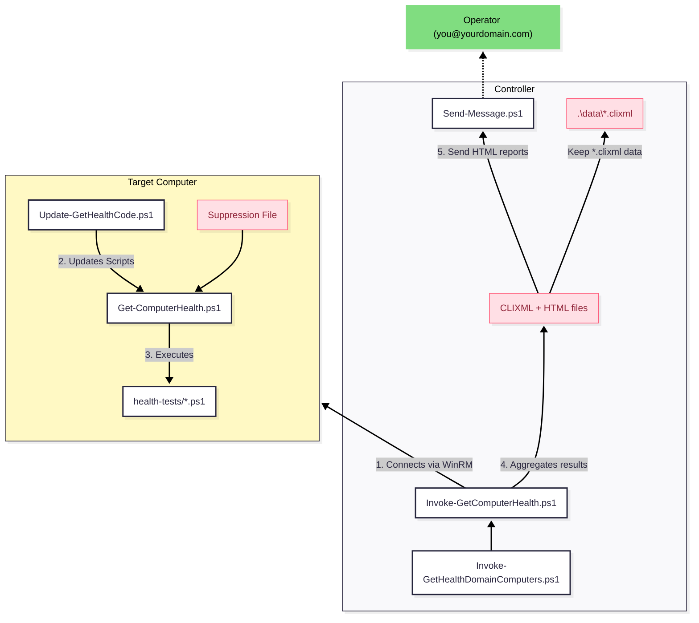

# Introduction

**Get-ComputerHealth** is a **production-ready, lightweight, secure, and extensible** PowerShell toolkit that **installs in a flash**. It scans your server, workstation, or fleet of domain servers for **more than a hundred health indicators**.

These include issues such as low RAM, missing updates, disk errors, and failed logins. They also include configuration changes, such as newly installed software, a TCP port that started listening, a host that stopped responding to pings, or a host that stopped accepting connections.

It produces **useful, concise reports and email alerts**. You can also add your own **custom health tests with plain PowerShell scripts**.


# Status / Is this toolkit for you?

This is a **robust production-tested toolkit** and I have been using it across several domains and multiple servers for many months.

**BUT:**

 1. **Don't expect official support.** I am happy to help when I can, but my availability is limited. You should be comfortable with PowerShell.
 2. **I am currently the only user I know of**, so there is a chance I have some blind spots.
 3. **There's a tiny chance of breaking changes.** I'll avoid them because I would have to clean up issues at several production sites. However, I *will do it* if the benefits are worth it to me.
 4. **I have not tested it on domains with more than a few dozen servers, or with DCs connected via WAN.** Some domain-related tests could cause excessive WAN traffic. Test while observing traffic. I would be glad to hear the results.

 > On the plus side, if you ever need to dive into the code, it is surprisingly small and straightforward: **the core is about 1,000 lines, including comments.** The HTML report code is heavier. The tests total more than ten thousand lines, but most are only a dozen or two dozen lines. Only a few are a few hundred lines. Any modern AI agent can understand and fix issues in this codebase. In fact, the vast majority of the code *was* written by Codex, with me acting as the architect, lead developer, reviewer, and QC.

## Comparison to PRTG, Zabbix

**Pros**: you can get from “nothing installed” to “definitely useful daily Windows health findings” in a minute, and adding custom tests is trivial.

**Cons**: it does not provide central dashboards, long-term metrics, escalation policies, maintenance windows, topology, dependency modeling, real-time monitoring, or support for non-Windows systems.

GetComputerHealth is intentionally smaller and focused on Windows administration. Out of the box, it includes many checks that Zabbix or PRTG can only reproduce through custom UserParameters, scripts, or purpose-built templates.

Examples include AD/GPO consistency, DNS/DHCP configuration hygiene, local hardening baselines, pending reboot/VSS/WMI/driver checks, unexpected open ports, stopped services, newly installed software, and others.

# Security

By default, the installer downloads and updates files from this GitHub repository every time you call any of the `Invoke-*.ps1` scripts. You can point the updater to a clone of this repo that you control by setting `RepoUrl` in `./config/gch.psd1`.

You can also disable automatic updates by setting `AutomaticUpdates = $false`.

This toolkit has **no external dependencies**.

Aside from installation, this code *should not change the state of the system in any way*. The code is intentionally simple and clean so it can be audited with a modern AI agent.

---

# 1. Admin Guide: Installation

## Optional Requirements

**To receive emails** with results/alerts, you need a mail server that permits unauthenticated delivery.

**To centrally scan workstations or servers**, you must be able to manage them with Remote PowerShell. For example, running `Enter-PSSession ComputerName` or `Invoke-Command ComputerName` should work. Domain-joined servers are usually centrally managed with zero configuration.

## Super-simple customized install

Customize and run this:
```powershell
Invoke-WebRequest -UseBasicParsing "https://raw.githubusercontent.com/ndemou/GetComputerHealth/refs/heads/main/Update-GetHealthCode.ps1" -OutFile ".\Update-GetHealthCode.ps1"
& .\Update-GetHealthCode.ps1 -Config @{
    Options = @{
        InstallDir = 'C:\IT\GetComputerHealth'
    }
    ConfigFiles = @{
        'Send-Message.psd1' = @{
            Server = 'smtp.contoso.com'
            From   = 'SERVER01+alerts@contoso.com'
            To     = 'ops@contoso.com;admin@contoso.com'
        }
        'gch.psd1' = @{
            AutomaticUpdates = $false
            SendReports = 'Auto' # 'Never', 'Always', or 'Auto'
            ShowAsPostponedWindowDays = 15
            IpsOfAllDCs = @('10.1.2.3', '10.1.2.4')
        }
    }
}
```

(You can also pass a file to  `-Config`.)


## Quick Run

Run these commands from an elevated PowerShell terminal:

```powershell
C:\IT\Get-ComputerHealth\bin\Invoke-GetComputerHealth.ps1
```

## Automatic Daily Monitoring of One Computer

TLDR: Verify you can send emails and schedule running `Invoke-GetComputerHealth.ps1` once a day. 

To test email delivery:
```powershell
C:\IT\Get-ComputerHealth\bin\Send-Message.ps1 -Subject "First test from $($env:COMPUTERNAME)" -ConfigFile "C:\IT\Get-ComputerHealth\config\Send-Message.conf" -Verbose
```


To schedule daily execution of `Invoke-GetComputerHealth.ps1` (change the time to one that suits you):

```powershell
. C:\IT\Get-ComputerHealth\bin\helpers-processes.ps1 # Imports the New-ScheduledTaskForPSScript command
New-ScheduledTaskForPSScript -ScriptPath "C:\IT\Get-ComputerHealth\bin\Invoke-GetComputerHealth.ps1" -ScheduleType Daily -Time 07:12
```

## Automatic Daily Monitoring of Multiple Domain-Joined Computers

1. Follow the instructions for monitoring a single computer on the management machine (the controller).
2. Copy the code below into your editor and fill in the proper values on the three lines under `CONFIGURATION`:

```powershell
# Executes Invoke-GetComputerHealth.ps1 on all domain-joined servers and any configured workstations
param([string]$Hide="DIPS",[string]$OnlyTheseTests,[switch]$SkipSlowTests,[switch]$SkipPolicyTests,[switch]$NoSendMessage,[switch]$NoUpdate)

#------------------CONFIGURATION---------------------------
$IpsOfAllDcs = @("10.10.10.1", "10.10.10.2")
$WindowsServersToExclude="ServerName1,ServerName2"
$WorkstationsToInclude="WorkstationName1,WorkstationName2"
#----------------------------------------------------------

if (-not $NoUpdate) {
	# Update local version of GetComputerHealth (only when a new version is found)
	& C:\IT\Get-ComputerHealth\bin\Update-GetHealthCode.ps1
}
& C:\IT\Get-ComputerHealth\bin\Invoke-GetComputerHealth.ps1 -Computers "ALL_DOMAIN_SERVERS,$WorkstationsToInclude" -ExcludeServers $WindowsServersToExclude -Hide:$Hide -OnlyTheseTests $OnlyTheseTests -SkipSlowTests:$SkipSlowTests -SkipPolicyTests:$SkipPolicyTests -NoSendMessage:$NoSendMessage -NoUpdate:$NoUpdate -PushUpdate -IpsOfAllDcs $IpsOfAllDcs
```

3. Save it as `C:\IT\bin\Invoke-GetHealthDomainComputers.ps1`.
4. Edit the scheduled task to execute this script instead of `C:\IT\Get-ComputerHealth\bin\Invoke-GetComputerHealth.ps1`.

---

# 2. Common Tasks

## How to Manually Perform a Domain Health Check

Run `C:\IT\bin\Invoke-GetHealthDomainComputers.ps1`.

> This scans all domain servers and any workstations you have configured, saves CLIXML data plus an interactive HTML report, and emails you any **notable** issues.
> The options mentioned above can also be used.
> Extra options like `-NoUpdate` and `-NoSendMessage` are particularly handy here.

## How to Suppress a finding (Permitlisting)

By default, health tests flag any deviation from a pristine Windows installation. Examples include a custom service, an extra member in the Administrators group, or an additional listening TCP port. 

If a finding is expected or a false positive, you can permitlist it.

1. **Identify the permitlisting command:** Open the generated HTML report or import the matching CLIXML file. Every message includes the exact command needed to permitlist it.
2. **Run that command** on the target machine.

> Advanced Tip: You can also permitlist findings manually:
> `C:\IT\Get-ComputerHealth\bin\Get-ComputerHealth.ps1 -AddWhitelisting -ComputerName $env:computername -Signature 12345678 -Comment "Usually the description of the finding" -Until 2099-12-31`

## How to Require a Finding That Proves Something Good Is Present

Sometimes a question equally important as "was any bad thing detected?" is "was the expected thing detected?". For example:

* was this TCP port listening? 
* was this process of service running?
* was this role or feature installed?

You can acomplish this in two steps:
1. Identify the signature of the finding you want to require.
2. Mark it as required and provide a description for future-you:

> `C:\IT\Get-ComputerHealth\bin\Get-ComputerHealth.ps1 -SetAsRequired -ComputerName $env:computername -Test UnexpectedListeningPorts -Signature bfc162fa -Comment "Port 443(IIS) should be listening but is not"`

> **IMPLEMENTATION DETAILS**: Required findings are stored in `C:\IT\Get-ComputerHealth\config\required_findings.psd1`. When a configured test runs, Get-ComputerHealth records the signatures it emitted. If one of that test's required signatures is missing, Get-ComputerHealth emits a new failure explaining that the required finding was not produced.

## How to Add Custom Tests

[Follow these instructions](./doc/how-to-add-custom-tests.md)

## Interactive execution of tests

```powershell
$results = C:\IT\Get-ComputerHealth\bin\Get-ComputerHealth.ps1 -OutputConsoleMessages -OutputObjects -Hide DIP
$results | ogv
```

> **Tips:**
> * `-OutputConsoleMessages` generates the colorful output in your console.
> * `-OutputObjects` is what populates `$results`.
> * `-Hide DIP` hides **D**ebug, **I**nfo, and **P**ass messages from the console, showing only **N**otices, **W**arnings, **F**ailures, and **S**uppressed messages.
> * Available options let you skip slow tests (`-SkipSlowTests`), skip non-essential tests (`-SkipNonEssentialTests`), exclude specific tests (`-ExcludeTests`), or run specific tests (`-OnlyTheseTests`). Autocomplete using `-` + `TAB` is your friend. `-ListAllBuiltInTests` will give you a list of all tests.

---

# 3. Architecture Overview

The toolkit operates on a **Controller–Agent** model, though it is agentless via PowerShell Remoting. You run the orchestration script on your management machine (the Controller). It executes tests on your servers or workstations (the Targets), aggregates the results into CLIXML and HTML reports, and emails them.

Think of the scripts as three layers:

 0. (**Only for multiple domain joined targets**) `Invoke-GetHealthDomainComputers.ps1` is a very light wrapper around `Invoke-GetComputerHealth.ps1`.
 1. `Invoke-GetComputerHealth.ps1` orchestrates update, target selection, remoting, collection, artifacts, and email.
 2. `Get-ComputerHealth.ps1` runs the actual health tests for one target context.
 3. `Health-test\*` scripts produce individual health messages.

## Relationship Diagram



---

# 4. Script Components Breakdown

This section explains the role of each file in your `C:\IT\Get-ComputerHealth\bin` directory.

## A. The Orchestrators

These are the scripts you actually execute.

### `Invoke-GetHealthDomainComputers.ps1`

* **Role:** The “Easy Button” wrapper for testing all domain servers and generating reports.
* **Function:** By default, it tests all computers running a Windows Server OS, but you are free to edit it to add extra hosts or exclude others.
* **Usage:** Run this manually or schedule it to run daily (via the SYSTEM account) to check the entire domain.
* **Note:** You need to create this script yourself; an example is provided in this documentation.

### `Invoke-GetComputerHealth.ps1` (for one computer)

* **Role:** The Engine/Orchestrator. It tests the local host by default or the computers you specify and generates reports.
* **Function:** It manages the workflow:
  1. Connects to the local host or one or more remote computers.
  2. Triggers a self-update on the remote target.
  3. Runs the health checks.
  4. Collects output, saves it in CLIXML, generates HTML reports, and emails *notable* (non-success) messages.
* **Key Parameters:** `-Computers` (list of targets, local host by default), `-ExcludeServers`, `-Hide` (defines which message types to hide from console output, usually "DIPS").
* **Email default caveat:** `Invoke-GetComputerHealth.ps1` sends email by default in non-interactive contexts, and does not send by default in interactive contexts. If you first connect with `Enter-PSSession` and then run the script on the remote host, that remote PowerShell host can still appear non-interactive to the script. Use `-NoSendReport` inside `Enter-PSSession` when you do not want the default email report.

# 5. Directory Structure Reference

| Path | Purpose |
| --- | --- |
| `C:\IT\Get-ComputerHealth\bin\`    | All script files (`.ps1`). |
| `C:\IT\Get-ComputerHealth\config\` | Configuration files. |
| `C:\IT\Get-ComputerHealth\config\required_findings.psd1` | Optional required findings that must be emitted by selected built-in tests. |
| `C:\IT\Get-ComputerHealth\config\Custom-HealthTests` | [Optional custom health tests.](./doc/how-to-add-custom-tests.md)  |
| `C:\IT\Get-ComputerHealth\temp\`   | Temp files like downloads and generated email HTML. |
| `C:\IT\Get-ComputerHealth\log\`    | Logs of script execution. |

# 6. Contributing

[See `CONTRIBUTING.md`](./CONTRIBUTING.md).

If you only want to add a few custom tests, you do not need to modify the core code. [See `doc/how-to-add-custom-tests.md`](./doc/how-to-add-custom-tests.md).


# 7. List of Available Tests

(Run `Get-ComputerHealth.ps1 -ListAllBuiltInTests` to get an always up-to-date list.)

| Name | Description |
| --- | --- |
| ADInboundReplicationTopology     | Verifies that each domain controller has inbound AD replication partners and connection objects |
| AdminSDHolderCoverage            | Reports whether AdminSDHolder protection is currently applied to any users |
| ADReplicationHealth              | Uses repadmin and local RSAT cross-checks to detect AD replication failures and stale replication |
| ADViewConsistency                | Verifies that domain controllers agree on the DC list and FSMO role holders |
| AutoStartServicesRunning         | Reports auto-start services that are not running, with extra context from their last exit code |
| BitLockerStatus                  | Checks whether detected volumes are protected by BitLocker |
| CertExpiry                       | Checks for certificates that are expired or nearing expiration |
| ConnectivityToDCs                | Checks DNS resolution and TCP connectivity to discovered domain controllers |
| CrashDumpSignals                 | Checks for recent minidumps that indicate recent system crashes |
| Dcdiag                           | Runs DCDIAG and reports failing basic and extended Active Directory diagnostics |
| DcDnsARecords                    | Checks whether domain controller hostnames resolve to expected A records |
| DcDnsRegistration                | Checks whether this domain controller has registered its expected DNS records |
| DcDnsServerForwarder             | Checks whether a domain controller DNS server has appropriate forwarders configured |
| DefaultLocale                    | Checks whether the system locale matches the expected legacy language baseline |
| DefenderStatus                   | Checks Microsoft Defender signature freshness and protection status |
| DfsDiagTestDCs                   | Runs DFSDIAG /TestDCs and reports unexpected DFS diagnostics output |
| DfsNamespaceEnumerate            | Checks whether DFS namespace roots and folders can be enumerated successfully |
| DfsrBacklog                      | Checks DFS Replication backlog and warns when queued updates are high |
| DfsReplicationState              | Checks whether DFS Replication folders are in the Normal state |
| DhcpDnsCredential                | Verifies that DHCP dynamic DNS update credentials are configured and resolve to a valid AD account |
| DhcpInAd                         | Checks whether a local DHCP server is authorized in Active Directory |
| DhcpScopeUtilization             | Checks DHCPv4 scopes for high address utilization |
| DisabledGpoLinksAtDomainRoot     | Checks for disabled or non-enforced GPO links at the domain root |
| DisksHaveFreeSpace               | Checks whether local disks have sufficient free space |
| DnsClientService                 | Checks whether the DNS Client service is running |
| DnsForwarders                    | Checks whether DNS forwarders are configured and reachable |
| DnsRecursionConfig               | Checks whether DNS recursion settings follow the expected baseline |
| DnsScavenging                    | Checks whether DNS scavenging and zone aging are enabled and configured sensibly |
| DnsSuffixBaseline                | Checks whether DNS suffix search settings match the expected domain baseline |
| DnsSuffixMatchesDomain           | Checks whether the primary DNS suffix matches the joined AD domain |
| DnsZoneReplicationScope          | Checks whether AD-integrated DNS zones use the expected replication scope |
| DnsZoneTransfers                 | Checks whether DNS zone transfers are disabled or restricted as expected |
| DomainARecordPointsToDcIp        | Checks whether the domain A record points to a DC IP |
| DuplicateSpn                     | Checks for duplicate Service Principal Names in Active Directory |
| EfsRecoveryAgents                | Checks whether EFS recovery agents are configured |
| EventLogMaxSizes                 | Checks whether key Windows event logs meet the configured minimum size baseline |
| FailedLoginAttemptsRecent        | Checks the Security log for failed login attempts within the last 24 hours |
| FirewallEnabled                  | Checks whether Windows Firewall profiles are enabled and the firewall service is available |
| GcPlacement                      | Checks whether each AD site has a Global Catalog and the domain has at least one GC |
| GpoVersionConsistency            | Checks whether each GPO has matching AD and SYSVOL version numbers |
| GpupdatePolicyApply              | Checks whether the machine secure channel is healthy enough for Group Policy processing |
| GpWmiFilterNamespacesOnLocalHost | Checks whether Group Policy WMI filter namespaces are accessible on the local host |
| HotfixBaseline                   | Checks whether all required hotfixes from the baseline are installed |
| HyperVReplicationHealth          | Checks Hyper-V VM replication health, missing replication, and running replica VMs |
| HyperVRunningVMs                 | Lists running Hyper-V virtual machines on the host |
| IisBindings                      | Checks IIS bindings for wildcard or otherwise risky binding configurations |
| ListRolesFeatures                | Lists installed Windows roles and features |
| InstalledSW                      | Reports installed software not present in the baseline inventory |
| InterfaceDnsServersUseDcs        | Checks whether member-server network interfaces use domain controllers as DNS servers |
| IPv6Binding                      | Checks whether IPv6 is bound on network adapters as expected |
| IsTPMActivated                   | Checks whether the TPM is present and activated |
| KerberosEncryptionTypes          | Checks for AD accounts that still permit weak RC4 Kerberos encryption |
| KrbtgtAge                        | Checks whether the KRBTGT password has been rotated within the allowed age threshold |
| LargeDirectories                 | Finds directories with more than 10000 child items |
| LdapSigningChannelBinding        | Checks whether LDAP signing and channel binding enforcement are enabled |
| LocalAcntRequirePass             | Checks whether local accounts require passwords |
| ListLocalAdmins                 | Lists members of the local Administrators group |
| MalwareProtectionFeatures        | Checks Microsoft Defender malware protection status and updates signatures when needed |
| NetworkConnectionProfiles        | Checks network connection profiles and basic connectivity expectations for each active network |
| Nic                              | Checks network adapters for unhealthy status or suspicious error counters |
| NltestSiteDiscovery              | Checks whether site discovery returns a valid AD site for the computer |
| ListShares                       | Lists SMB shares and notes when file and print sharing is unnecessarily enabled |
| ListServices                     | Lists services and highlights unusual or suspicious service vendors |
| NtdsLogVolumeFree                | Checks whether the NTDS log volume has enough free space |
| NtdsPathsLocation                | Checks whether the NTDS database and log paths are on expected volumes |
| NtfsDirtyBit                     | Checks whether any NTFS volumes have the dirty bit set |
| NtlmHardening                    | Checks whether NTLM hardening registry settings meet the security baseline |
| PagefileSanity                   | Checks whether paging file configuration is present and sized sensibly |
| PendingReboot                    | Checks for Windows pending-reboot indicators |
| PreWin2000Group                  | Checks whether the Pre-Windows 2000 Compatible Access group has unexpected members |
| RamPressure                      | Checks for sustained memory pressure using available memory and commit counters |
| RdpHardening                     | Checks whether RDP is hardened with NLA enabled and a TLS certificate bound |
| RecentWindowsScan                | Checks whether Microsoft Defender has performed a recent quick scan |
| RecycleBinEnabled                | Checks whether Active Directory Recycle Bin is enabled |
| ReplicationLatency               | Assesses AD replication latency and correlates it with replication trouble signals |
| RequiredSrvRecords               | Checks whether required AD DNS SRV records resolve successfully |
| RestrictAnonymous                | Checks whether anonymous access hardening settings meet the baseline |
| ReverseZonesPresent              | Checks whether required reverse lookup zones exist |
| RidManager                       | Runs the RID Manager dcdiag test and reports any detected issues |
| RodcPrp                          | Checks whether each read-only domain controller has a Password Replication Policy configured |
| RunningProcesses                 | Emits a suppressed inventory notice for each running process |
| SchanelBaseline                  | Checks whether Schannel disables legacy protocols and keeps TLS 1.2 enabled |
| ScheduledTasks                   | Reviews non-Microsoft scheduled tasks for failures and excessive missed runs |
| ScheduledTasksLastResult         | Parses scheduled task last-result data and reports task failures or warnings |
| SchemaVersionConsistency         | Checks whether all domain controllers report the same AD schema version |
| SeriousRecentEventLogs           | Checks recent event logs for serious shutdown, bugcheck, disk, or application crash events |
| ServiceAccountsPwdNeverExpires   | Checks for service accounts whose passwords are set to never expire |
| ShadowStorage                    | Checks whether Volume Shadow Copy storage is configured and sized within the recommended range |
| ShareReasonableness              | Checks SMB shares for risky or unreasonable share exposure |
| SingleDefaultGateway             | Checks for multiple default gateways and validates that the active gateway configuration is sensible |
| Smb1Disabled                     | Checks whether SMBv1 is disabled |
| SmbSigningRequired               | Checks whether the SMB server requires signing when the server service is running |
| SoftwareLicensing                | Checks Windows software licensing state and activation status |
| StaleRdpSessions                 | Checks for idle or disconnected RDP sessions older than the allowed threshold |
| StartupItems                     | Lists startup items found in standard registry and startup-folder locations |
| Storage                          | Checks physical disks for predictive failure, unhealthy status, temperature, and reliability warnings |
| SystemScheduledTasks             | Checks relevant SYSTEM scheduled tasks for disabled, stale, or failing states |
| SysvolAclHygiene                 | Checks whether SYSVOL grants write access to overly broad principals |
| SysvolContentConsistency         | Checks whether SYSVOL policy content is present and consistent across domain controllers |
| SysvolNetlogonAccessible         | Checks whether each domain controller exposes reachable SYSVOL and NETLOGON shares |
| TimeSyncAccuracy                 | Checks whether the local clock appears reasonably synchronized |
| TimeSyncPolicy                   | Checks whether Windows Time is configured against the expected time source policy |
| TombstoneLifetime                | Checks whether the AD tombstoneLifetime meets the minimum baseline |
| TrustsVerify                     | Verifies Active Directory trusts and reports any trust validation failures |
| UnconstrainedDelegationAccounts  | Checks for accounts that are configured for unconstrained delegation |
| UnexpectedListeningPorts         | Compares listening TCP ports to the baseline and identifies unexpected listeners with process context |
| UnsignedDrivers                  | Checks for installed PnP driver packages that appear unsigned |
| UnusedEnabledAdapters            | Checks for enabled network adapters that are disconnected and likely unused |
| UpdateAge                        | Checks how long it has been since the latest installed Windows update |
| VssWriters                       | Checks whether all VSS writers report healthy stable states |
| WinRMListening                   | Checks whether the WinRM service is running and responds to WSMan requests |
| WmiRepository                    | Checks whether the WMI repository is consistent |
