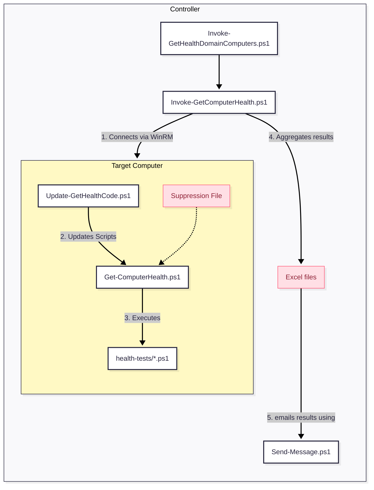

# Introduction

**Get-ComputerHealth** is a lightweight, extendable PowerShell framework. It is suitable both for a single workstation or server, and for a domain with a few dozen servers. It produces clean terminal output, concise Excel reports, and email alerts.

It is a native, agentless alternative to heavy monitoring suites. Installation is simple, usually taking no more than two minutes per server once you are familiar with it. If you have basic PowerShell skills, you can easily add your own custom health tests.

For domains the only requirement is to enable PowerShell remoting to the servers or workstations you want to monitor. Once you can manage them through with `Enter-PSSession`/`Invoke-Command` everything works.


# Status & Is this code for you?

This code is actively used in production across several domains and multiple servers, but as far as I know, I am its only user.

It has worked well for months. There's still a possibility of some annoying change happening, but mostly just annoying extra alerts you shouldn't be receiving.

I am happy to help when I can, but my availability is limited. If you decide to use it, **assume you are on your own**. You should be comfortable with PowerShell.

On the plus side, in the unlikely event that you need to dive into the code, it is surprisingly small and straightforward: **the core is about 1,000 lines, including comments**. The tests *are* over ten thousand lines, but the vast majority are self-contained and small.

# Security

The installer(`Update-GetHealthCode.ps1`), downloads and updates files from this GitHub. It may do so *every* time you call `Invoke-GetComputerHealth.ps1`. It's strongly recomended that you clone this repo, audit it and then change the `$URI=` line of `Update-GetHealthCode.ps1` to point to your copy. Besides installation this code should not change the state of the system it runs on in any way. So autiting with a modern LLM is in fact quite easy. 

The installer registers and sets PSGallery as Trusted, and installs PS module `ImportExcel`.

# 0. Prerequisites

**For a single server or workstation:** None if you run this script manually; a mail server that permits unauthenticated delivery if you wish to receive emails with results or alerts.

**For a small to medium domain (a few dozen servers, all DCs connected via LAN):**

1. The ability to administer servers via PowerShell Remoting (`Enter-PSSession`/`Invoke-Command`).
2. A mail server that permits unauthenticated delivery.

**For a large domain (more than a few dozen servers, some DCs connected via WAN):** I would not use this code for that scenario. I have not tested it, and I am concerned about some of the DC-related tests causing excessive WAN traffic.


# 1. Architecture Overview

The toolkit operates on a **Controller–Agent** model (though agentless via PowerShell Remoting). You run the orchestration script on your management machine (the Controller), which executes tests on your servers/workstations (the Targets), then aggregates the results into Excel reports and emails them.

## Relationship Diagram



---

# 2. Script Components Breakdown

This section explains the role of each file in your `C:\IT\bin` directory.

## A. The Orchestrators (Run These)

These are the scripts you actually execute.

### `Invoke-GetHealthDomainComputers.ps1` (for multiple computers; e.g., all domain servers)

* **Role:** The “Easy Button” wrapper for testing all domain servers.
* **Function:** By default, it scans all computers running a Windows Server OS, but you are encouraged to edit it to add extra hosts or exclude others.
* **Usage:** Run this manually or schedule it to run daily (e.g., via the SYSTEM account) to check the entire domain.
* **Note:** You need to create this script yourself. It’s just one command, and you’ll find an example below.

### `Invoke-GetComputerHealth.ps1` (for one computer)

* **Role:** The Engine/Orchestrator. It tests the local host by default or the computers you specify.

* **Function:** It manages the workflow:

  1. Connects to the local host or one or more remote computers.
  2. Triggers the self-update on the remote target.
  3. Runs the health checks remotely.
  4. Collects output, saves it in Excel format (`C:\IT\temp\`), and emails “Notable” (non-success) messages.

* **Key Parameters:** `-Computers` (list of targets), `-ExcludeServers`, `-Hide` (which types of messages to hides from console output).

## B. The Worker (Runs on Targets)

These scripts run locally on the servers being checked.

* **`Get-ComputerHealth.ps1`**

  * **Role:** The Local Runner.
  * **Function:** It loads the test library and executes the tests. It handles the logic for **whitelisting** (suppressing known failures) and generates clean, colorized console output.
  * **Usage:** Can be run interactively on a specific server for troubleshooting (e.g., `.\Get-ComputerHealth.ps1 -OutputConsoleMessages`).

* **`health-tests\*.ps1`**

  * **Role:** The Logic Library.
  * **Function:** Contains the actual code for checks like `DiskSpace` and `TimeSyncPolicy`. These scripts live under `health-tests\` and are dot-sourced by the Runner.

* **`Update-GetHealthCode.ps1`**

  * **Role:** The Updater.
  * **Function:** Ensures the local `C:\IT\bin` folder has the latest version of all scripts by downloading them from a central repository. It runs automatically before tests begin.

## C. Utilities

* **`Send-Message.ps1`**: A utility wrapper for sending SMTP emails (configured via `C:\IT\config\Send-Message.conf`).

---

# 3. Admin Guide: Installation

## OPTION 1: Installation Plus a Quick Run

* **Note:** Installation and execution need to populate these folders with files — make sure this does not interfere with anything else:

  * C:\IT\bin
  * C:\IT\config
  * C:\IT\log
  * C:\IT\temp
* **Security Note:** Each time you run `Invoke-GetComputerHealth`, it will call `Update-GetHealthCode.ps1` and fetch code from this repository.

Run these commands from an elevated PowerShell terminal:

```powershell
# Create C:\IT\bin and download installer/updater script
if (-not (Test-Path "C:\IT\bin")) { New-Item -Path "C:\IT\bin" -ItemType Directory -Force }
Invoke-WebRequest -useb "https://raw.githubusercontent.com/ndemou/GetComputerHealth/refs/heads/main/Update-GetHealthCode.ps1" -OutFile "C:\IT\bin\Update-GetHealthCode.ps1"

# Download all other scripts & install required modules
C:\IT\bin\Update-GetHealthCode.ps1 

# Perform your first health test manually
C:\IT\bin\Invoke-GetComputerHealth.ps1
```

## OPTION 2: Installation Plus Automatic Daily Monitoring of One Computer

* **Note:** Installation and execution need to populate these folders with files — make sure this does not interfere with anything else:

  * C:\IT\bin
  * C:\IT\config
  * C:\IT\log
  * C:\IT\temp
* **Security Note:** Each time you run `Invoke-GetComputerHealth`, it will call `Update-GetHealthCode.ps1` and fetch code from this repository.

1. Copy the commands below into Notepad.
2. Replace the *PLACEHOLDERS* at the top with your actual configuration.
3. Run all commands from an elevated PowerShell terminal.

```powershell
#--------- CHANGE THIS PART ---------
$mailServer="SMTP_SERVER.CONTOSO.COM"
$fromAddress="SENDER@CONTOSO.COM"
$toAddress="RECIPIENT@CONTOSO.COM"
#------------------------------------

# Create C:\IT\bin and download installer/updater script
if (-not (Test-Path "C:\IT\bin")) { New-Item -Path "C:\IT\bin" -ItemType Directory -Force }
Invoke-WebRequest -useb "https://raw.githubusercontent.com/ndemou/GetComputerHealth/refs/heads/main/Update-GetHealthCode.ps1" -OutFile "C:\IT\bin\Update-GetHealthCode.ps1"

# Download all other scripts & install required modules
C:\IT\bin\Update-GetHealthCode.ps1 

# Setup email delivery
@"
{"Server":  "$mailServer",
"From":  "$($env:COMPUTERNAME)+$fromAddress",
"To":  "$toAddress",
"Port":  25,
"UseSsl":  false}
"@ | Out-File "C:\IT\config\Send-Message.conf" -Encoding utf8 -Force

# Test email delivery
C:\IT\bin\Send-Message.ps1 -Subject "First test from $($env:COMPUTERNAME)" -ConfigFile "C:\IT\config\Send-Message.conf" -Verbose

# Perform your first health test manually
C:\IT\bin\Invoke-GetComputerHealth.ps1

# Schedule automatic execution of daily health tests
. C:\IT\bin\helpers-processes.ps1 # Imports the New-ScheduledTaskForPSScript command
New-ScheduledTaskForPSScript -ScriptPath "C:\IT\bin\Invoke-GetComputerHealth.ps1" -ScheduleType Daily -Time 07:12
```

## OPTION 3: Installation Plus Automatic Daily Monitoring of Multiple Domain-Joined Computers

1. Follow the instructions for monitoring one computer on the master computer (the controller). If everything works well, create a script `C:\IT\bin\Invoke-GetHealthDomainComputers.ps1`. Here is an example; change or remove workstation1, workstation2, and server1, server2:
```powershell
# Executes Invoke-GetComputerHealth.ps1 with proper arguments to select all domain joined servers
# Uses -PushUpdate so remotes are updated from the master's cached release zip (fewer GitHub calls).
param([string]$Hide="DIP",[string]$OnlyTheseTests,[switch]$SkipSlowTests,[switch]$SkipPolicyTests,[switch]$NoSendMessage,[switch]$NoUpdate)

$IpsOfAllDcs = @(
  "10.10.0.10", # dc1
  "10.10.0.11"  # dc2
)

& c:\it\bin\Invoke-GetComputerHealth.ps1 -Computers "ALL_DOMAIN_SERVERS,workstation1,workstation2" -ExcludeServers "server1,server2" -Hide:$Hide -OnlyTheseTests $OnlyTheseTests -SkipSlowTests:$SkipSlowTests -SkipPolicyTests:$SkipPolicyTests -NoSendMessage:$NoSendMessage -NoUpdate:$NoUpdate -PushUpdate -IpsOfAllDcs $IpsOfAllDcs
```

`Invoke-GetHealthDomainComputers.ps1` must supply `-IpsOfAllDcs` when calling `Invoke-GetComputerHealth.ps1`.

2. Edit the scheduled task to execute the script you created instead of `C:\IT\bin\Invoke-GetComputerHealth.ps1`. 

---

# 4. Admin Guide: Common Tasks

## How to Manually Perform a Health Check for One Computer

Open PowerShell as Administrator and run:

```powershell
C:\IT\bin\Invoke-GetComputerHealth.ps1
```

* **Result:** This scans the local machine, saves an Excel report to `C:\IT\temp\`, and emails you any “Notable” issues (Notices/Warnings/Failures).

## How to Run a Domain Health Check (scan all domain computers running Server editions of Windows)

If you have created `C:\IT\bin\Invoke-GetHealthDomainComputers.ps1`execute it. 
Otherwise open PowerShell as Administrator and run:

```powershell
& c:\it\bin\Invoke-GetComputerHealth.ps1 -Computers "ALL_DOMAIN_SERVERS,workstation1,workstation2" -ExcludeServers "server1,server2"
```

## How to Suppress a False Positive (Whitelisting)

By default, the health tests will flag any deviation from a pristine Windows installation (e.g., a custom service, an extra member in the Administrators group, or an additional listening TCP port). If this is expected, you should whitelist it.

1. **Identify the whitelisting command:** Open the generated Excel report. Every message includes a column containing the exact command needed to whitelist that entry.
2. **Apply the whitelist:** Run that command on the **target machine** (or via a remote shell).

* **Under the hood:** This adds the unique signature to `C:\IT\config\Get-ComputerHealth.sigs-to-suppress.txt`. Future runs will mark this specific issue as “Suppressed” and will not consider it “Notable.”

## How to Check a Single Server Interactively

To debug a specific server locally:

```powershell
C:\IT\bin\Get-ComputerHealth.ps1 -OutputConsoleMessages -OutputObjects -Hide DIP
```

* **Tip:** `-Hide DIP` hides **D**ebug, **I**nfo, and **P**ass messages, showing only **N**otices, **W**arnings, **F**ailures and **S**uppressed messages.

## How to Add Custom Tests

You do not need to modify the core library. [Follow these instructions](./doc/how-to-add-custom-tests.md)

# 5. Directory Structure Reference

| Path | Purpose |
| --- | --- |
| `C:\IT\bin\` | Contains all script files (`.ps1`). |
| `C:\IT\config\` | Contains configuration files (`Send-Message.conf`) and the suppression list (`Get-ComputerHealth.sigs-to-suppress.txt`). |
| `C:\IT\temp\` | Staging area for downloads and location of generated Excel reports. |
| `C:\IT\log\` | Stores transcript logs of script execution. |


# 6. Contributing

Contributor documentation now lives in [`CONTRIBUTING.md`](./CONTRIBUTING.md).

The guide for writing custom health tests remains separate:

- [`doc/how-to-add-custom-tests.md`](./doc/how-to-add-custom-tests.md)


# 7. List of Available Tests

(Run `Get-ComputerHealth.ps1 -ListAllBuiltInTests` to get an always up to date list.)

### Configuration Hygiene & Best Practices

- **ADViewConsistency**: Verifies that domain controllers agree on the DC list and FSMO role holders.
- **Dcdiag**: Runs DCDIAG and reports failing basic and extended Active Directory diagnostics.
- **RidManager**: Runs the RID Manager dcdiag test and reports any detected issues.
- **DfsReplicationState**: Checks whether DFS Replication folders are in the Normal state.
- **DfsrBacklog**: Checks DFS Replication backlog and warns when queued updates are high.
- **GpoVersionConsistency**: Checks whether each GPO has matching AD and SYSVOL version numbers.
- **ADInboundReplicationTopology**: Verifies that each domain controller has inbound AD replication partners and connection objects.
- **RodcPrp**: Checks whether each read-only domain controller has a Password Replication Policy configured.
- **DfsDiagTestDCs**: Runs DFSDIAG /TestDCs and reports unexpected DFS diagnostics output.
- **DfsNamespaceEnumerate**: Checks whether DFS namespace roots and folders can be enumerated successfully.
- **PreWin2000Group**: Checks whether the Pre-Windows 2000 Compatible Access group has unexpected members.
- **TrustsVerify**: Verifies Active Directory trusts and reports any trust validation failures.
- **AdminSDHolderCoverage**: Reports whether AdminSDHolder protection is currently applied to any users.
- **DisabledGpoLinksAtDomainRoot**: Checks for disabled or non-enforced GPO links at the domain root.
- **KrbtgtAge**: Checks whether the KRBTGT password has been rotated within the allowed age threshold.
- **SysvolContentConsistency**: Checks whether SYSVOL policy content is present and consistent across domain controllers.
- **SysvolNetlogonAccessible**: Checks whether each domain controller exposes reachable SYSVOL and NETLOGON shares.
- **UnusedEnabledAdapters**: Checks for enabled network adapters that are disconnected and likely unused.
- **SchemaVersionConsistency**: Checks whether all domain controllers report the same AD schema version.
- **TombstoneLifetime**: Checks whether the AD tombstoneLifetime meets the minimum baseline.
- **RecycleBinEnabled**: Checks whether Active Directory Recycle Bin is enabled.
- **ReplicationLatency**: Assesses AD replication latency and correlates it with replication trouble signals.
- **NtdsLogVolumeFree**: Checks whether the NTDS log volume has enough free space.
- **NtdsPathsLocation**: Checks whether the NTDS database and log paths are on expected volumes.
- **GcPlacement**: Checks whether each AD site has a Global Catalog and the domain has at least one GC.
- **DuplicateSpn**: Checks for duplicate Service Principal Names in Active Directory.
- **ADReplicationHealth**: Uses repadmin and local RSAT cross-checks to detect AD replication failures and stale replication.
- **DnsScavenging**: Checks whether DNS scavenging and zone aging are enabled and configured sensibly.
- **DnsZoneReplicationScope**: Checks whether AD-integrated DNS zones use the expected replication scope.
- **ReverseZonesPresent**: Checks whether required reverse lookup zones exist.
- **DcDnsServerForwarder**: Checks whether a domain controller DNS server has appropriate forwarders configured.
- **DnsForwarders**: Checks whether DNS forwarders are configured and reachable.
- **DnsRecursionConfig**: Checks whether DNS recursion settings follow the expected baseline.
- **DcDnsARecords**: Checks whether domain controller hostnames resolve to expected A records.
- **DcDnsRegistration**: Checks whether this domain controller has registered its expected DNS records.
- **DnsSuffixBaseline**: Checks whether DNS suffix search settings match the expected domain baseline.
- **ConnectivityToDCs**: Checks DNS resolution and TCP connectivity to discovered domain controllers.
- **EfsRecoveryAgents**: Checks whether EFS recovery agents are configured.
- **GpWmiFilterNamespacesOnLocalHost**: Checks whether Group Policy WMI filter namespaces are accessible on the local host.
- **LargeDirectories**: Finds directories with more than 10000 child items.
- **HyperVRunningVMs**: Lists running Hyper-V virtual machines on the host.
- **InterfaceDnsServersUseDcs**: Checks whether member-server network interfaces use domain controllers as DNS servers.
- **DnsSuffixMatchesDomain**: Checks whether the primary DNS suffix matches the joined AD domain.
- **DomainARecordPointsToDcIp**: Checks whether the domain A record points to a DC IP.
- **NltestSiteDiscovery**: Checks whether site discovery returns a valid AD site for the computer.
- **GpupdatePolicyApply**: Checks whether the machine secure channel is healthy enough for Group Policy processing.
- **NetworkConnectionProfiles**: Checks network connection profiles and basic connectivity expectations for each active network.
- **SingleDefaultGateway**: Checks for multiple default gateways and validates that the active gateway configuration is sensible.
- **IPv6Binding**: Checks whether IPv6 is bound on network adapters as expected.
- **Nic**: Checks network adapters for unhealthy status or suspicious error counters.
- **WinRMListening**: Checks whether the WinRM service is running and responds to WSMan requests.
- **TimeSyncPolicy**: Checks whether Windows Time is configured against the expected time source policy.
- **UpdateAge**: Checks how long it has been since the latest installed Windows update.
- **CertExpiry**: Checks for certificates that are expired or nearing expiration.
- **IisBindings**: Checks IIS bindings for wildcard or otherwise risky binding configurations.
- **RamPressure**: Checks for sustained memory pressure using available memory and commit counters.
- **ShareReasonableness**: Checks SMB shares for risky or unreasonable share exposure.
- **DisksHaveFreeSpace**: Checks whether local disks have sufficient free space.
- **RequiredSrvRecords**: Checks whether required AD DNS SRV records resolve successfully.
- **SoftwareLicensing**: Checks Windows software licensing state and activation status.
- **TimeSyncAccuracy**: Checks whether the local clock appears reasonably synchronized.
- **PagefileSanity**: Checks whether paging file configuration is present and sized sensibly.
- **Storage**: Checks physical disks for predictive failure, unhealthy status, temperature, and reliability warnings.
- **NtfsDirtyBit**: Checks whether any NTFS volumes have the dirty bit set.
- **EventLogMaxSizes**: Checks whether key Windows event logs meet the configured minimum size baseline.
- **ScheduledTasks**: Reviews non-Microsoft scheduled tasks for failures and excessive missed runs.
- **SystemScheduledTasks**: Checks relevant SYSTEM scheduled tasks for disabled, stale, or failing states.
- **ScheduledTasksLastResult**: Parses scheduled task last-result data and reports task failures or warnings.
- **DhcpInAd**: Checks whether a local DHCP server is authorized in Active Directory.
- **DhcpScopeUtilization**: Checks DHCPv4 scopes for high address utilization.
- **InstalledRolesFeatures**: Checks for installed Windows roles or features that are outside the intended baseline.
- **AutoStartServicesRunning**: Reports auto-start services that are not running, with extra context from their last exit code.
- **NonMicrosoftServices**: Identifies non-core Microsoft services and highlights unusual or suspicious service vendors.
- **StartupItems**: Lists startup items found in standard registry and startup-folder locations.
- **RecentWindowsScan**: Checks whether Microsoft Defender has performed a recent quick scan.
- **SchanelBaseline**: Checks whether Schannel disables legacy protocols and keeps TLS 1.2 enabled.
- **WmiRepository**: Checks whether the WMI repository is consistent.
- **VssWriters**: Checks whether all VSS writers report healthy stable states.
- **CrashDumpSignals**: Checks for recent minidumps that indicate recent system crashes.
- **SeriousRecentEventLogs**: Checks recent event logs for serious shutdown, bugcheck, disk, or application crash events.
- **HotfixBaseline**: Checks whether all required hotfixes from the baseline are installed.
- **StaleRdpSessions**: Checks for idle or disconnected RDP sessions older than the allowed threshold.
- **NonDefaultShares**: Detects non-default SMB shares and notes when file and print sharing is unnecessarily enabled.
- **LocalAcntRequirePass**: Checks whether local accounts require passwords.
- **DefaultLocale**: Checks whether the system locale matches the expected legacy language baseline.
- **PendingReboot**: Checks for Windows pending-reboot indicators.
- **ShadowStorage**: Checks whether Volume Shadow Copy storage is configured and sized within the recommended range.
- **LocalAdminsBaseline**: Checks for unexpected members in the local Administrators group.
- **UnexpectedListeningPorts**: Compares listening TCP ports to the baseline and identifies unexpected listeners with process context.
- **InstalledSW**: Reports installed software not present in the baseline inventory.

### Security & Stability Risks

- **KerberosEncryptionTypes**: Checks for AD accounts that still permit weak RC4 Kerberos encryption.
- **SysvolAclHygiene**: Checks whether SYSVOL grants write access to overly broad principals.
- **ServiceAccountsPwdNeverExpires**: Checks for service accounts whose passwords are set to never expire.
- **UnconstrainedDelegationAccounts**: Checks for accounts that are configured for unconstrained delegation.
- **DhcpDnsCredential**: Verifies that DHCP dynamic DNS update credentials are configured and resolve to a valid AD account.
- **DnsZoneTransfers**: Checks whether DNS zone transfers are disabled or restricted as expected.
- **IsTPMActivated**: Checks whether the TPM is present and activated.
- **LdapSigningChannelBinding**: Checks whether LDAP signing and channel binding enforcement are enabled.
- **MalwareProtectionFeatures**: Checks Microsoft Defender malware protection status and updates signatures when needed.
- **DefenderStatus**: Checks Microsoft Defender signature freshness and protection status.
- **FirewallEnabled**: Checks whether Windows Firewall profiles are enabled and the firewall service is available.
- **Smb1Disabled**: Checks whether SMBv1 is disabled.
- **UnsignedDrivers**: Checks for installed PnP driver packages that appear unsigned.
- **BitLockerStatus**: Checks whether detected volumes are protected by BitLocker.
- **NtlmHardening**: Checks whether NTLM hardening registry settings meet the security baseline.
- **RdpHardening**: Checks whether RDP is hardened with NLA enabled and a TLS certificate bound.
- **RestrictAnonymous**: Checks whether anonymous access hardening settings meet the baseline.
- **SmbSigningRequired**: Checks whether the SMB server requires signing when the server service is running.
- **DnsClientService**: Checks whether the DNS Client service is running.
