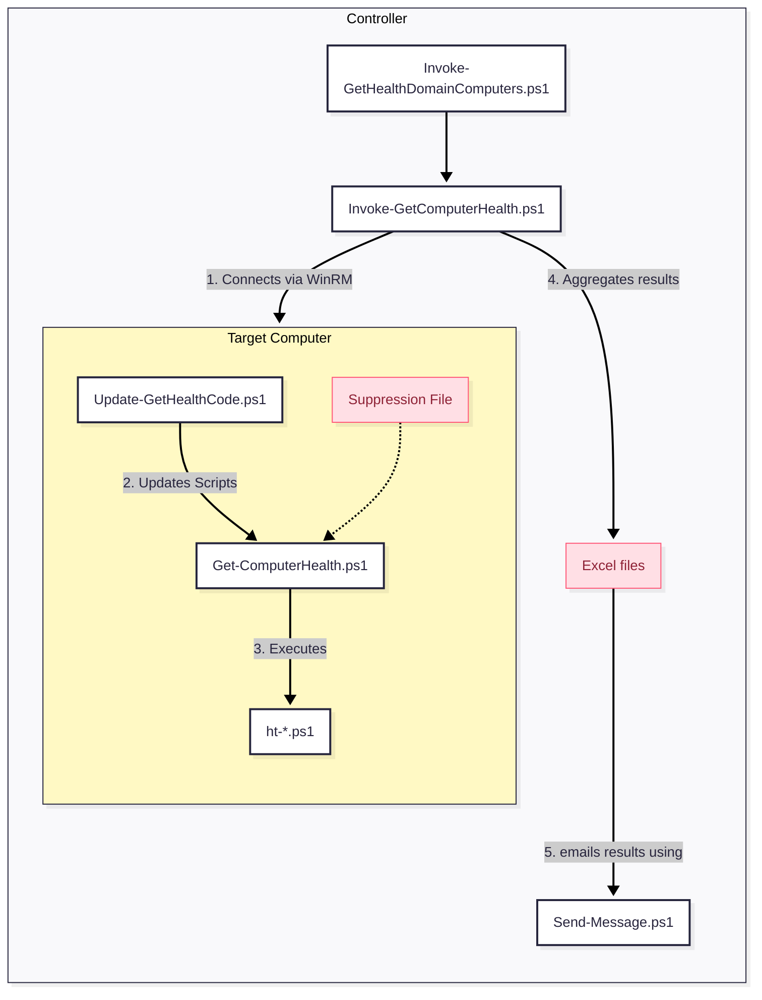

# Get-ComputerHealth

Stop wondering whether your disks have free space, whether Windows is up to date, whether critical services are running, or whether your DCs are replicating. This extensible, **open-source** toolkit automates over a hundred daily health checks you know you should be doing but don’t have time for. It’s a **free**, set-and-forget health monitor that gives you **near enterprise-grade visibility** without the usual complexity, overhead, or cost.

Designed as a **lightweight** alternative to heavy monitoring suites, the framework uses native PowerShell Remoting to perform deep analysis of your infrastructure without installing a single agent. It’s perfect for a single workstation or server, but it also works great for domains with a few dozen servers that you already manage via PowerShell (`Enter-PSSession`/`Invoke-Command`). It generates clean terminal output, concise Excel reports, and actionable email alerts that highlight risks before they become disasters.

Installation is extremely easy. Once you spend a few minutes getting familiar with it, you’ll rarely need more than two minutes per server. If you have even a little PowerShell fluency, you can easily add your own custom health tests.


# Status & Is this code for you?

This code is actively used in production across several domains (multiple servers), but as far as I know, only by me (the author). 

Although everything seems to work, I'm still at an early stage and thus, large refactoring of code and new tests are expected.

I’m happy to help when I can, but "when I can" is not much. So, **if you want to use it, you must assume you are alone**. You should be comfortable with PowerShell and prepared to invest your time and LLM tokens. The good news is that the codebase is very simple. The only reason it's large is because there are a lot of tests.

# Security

The installer(`Update-GetHealthCode.ps1`), downloads and updates files from this GitHub. It does so *every* time you call `Invoke-GetComputerHealth.ps1`. It's strongly recomended that you clone this repo, audit it and then change the `$URI=` line of `Update-GetHealthCode.ps1` to point to your copy. Besides installation this code should not change the state of the system it runs on in any way. So autiting with a modern LLM is in fact quite easy. 

The installer also registers and sets PSGallery as Trusted, and installs PS module `ImportExcel`.

# 0. Prerequisites

**For a single server or workstation:** None if you run this script manually; a mail server that permits unauthenticated delivery if you wish to receive emails with results or alerts.

**For a small to medium domain (a few dozen servers, all DCs connected via LAN):**

1. The ability to administer servers via PowerShell Remoting (`Enter-PSSession`/`Invoke-Command`).
2. A mail server that permits unauthenticated delivery.

**For a large domain (more than a few dozen servers, some DCs connected via WAN):** I would not use this code for that scenario. I have not tested it, and I am concerned about some of the DC-related tests causing excessive WAN traffic.


# 1. Architecture Overview

The toolkit operates on a **Controller–Agent** model (though agentless via PowerShell Remoting). You run the orchestration script on your management machine (the Controller), which executes tests on your servers/workstations (the Targets), then aggregates the results into Excel reports and emails them.

## Relationship Diagram



---

# 2. Script Components Breakdown

This section explains the role of each file in your `C:\IT\bin` directory.

## A. The Orchestrators (Run These)

These are the scripts you actually execute.

### `Invoke-GetHealthDomainComputers.ps1` (for multiple computers; e.g., all domain servers)

* **Role:** The “Easy Button” wrapper for testing all domain servers.
* **Function:** By default, it scans all computers running a Windows Server OS, but you are encouraged to edit it to add extra hosts or exclude others.
* **Usage:** Run this manually or schedule it to run daily (e.g., via the SYSTEM account) to check the entire domain.
* **Note:** You need to create this script yourself. It’s just one command, and you’ll find an example below.

### `Invoke-GetComputerHealth.ps1` (for one computer)

* **Role:** The Engine/Orchestrator. It tests the local host by default or the computers you specify.

* **Function:** It manages the workflow:

  1. Connects to the local host or one or more remote computers.
  2. Triggers the self-update on the remote target.
  3. Runs the health checks remotely.
  4. Collects output, saves it in Excel format (`C:\IT\temp\`), and emails “Notable” (non-success) messages.

* **Key Parameters:** `-Computers` (list of targets), `-ExcludeServers`, `-Hide` (filters output levels).

## B. The Worker (Runs on Targets)

These scripts run locally on the servers being checked.

* **`Get-ComputerHealth.ps1`**

  * **Role:** The Local Runner.
  * **Function:** It loads the test library and executes the tests. It handles the logic for **whitelisting** (suppressing known failures) and generates clean, colorized console output.
  * **Usage:** Can be run interactively on a specific server for troubleshooting (e.g., `.\Get-ComputerHealth.ps1 -OutputConsoleMessages`).

* **`ht-*.ps1`**

  * **Role:** The Logic Library.
  * **Function:** Contains the actual code for checks like `HealthTest-DiskSpace` and `HealthTest-TimeSyncPolicy`. It is a library and does not run on its own; it is loaded by the Runner.

* **`Update-GetHealthCode.ps1`**

  * **Role:** The Updater.
  * **Function:** Ensures the local `C:\IT\bin` folder has the latest version of all scripts by downloading them from a central repository. It runs automatically before tests begin.

## C. Utilities

* **`Send-Message.ps1`**: A utility wrapper for sending SMTP emails (configured via `C:\IT\config\Send-Message.conf`).

---

# 3. Admin Guide: Installation

## OPTION 1: Installation Plus a Quick Run

* **Note:** Installation and execution need to populate these folders with files — make sure this does not interfere with anything else:

  * C:\IT\bin
  * C:\IT\config
  * C:\IT\log
  * C:\IT\temp
* **Security Note:** Each time you run `Invoke-GetComputerHealth`, it will call `Update-GetHealthCode.ps1` and fetch code from this repository.

Run these commands from an elevated PowerShell terminal:

```powershell
# Create C:\IT\bin and download installer/updater script
if (-not (Test-Path "C:\IT\bin")) { New-Item -Path "C:\IT\bin" -ItemType Directory -Force }
Invoke-WebRequest -useb "https://raw.githubusercontent.com/ndemou/GetComputerHealth/refs/heads/main/Update-GetHealthCode.ps1" -OutFile "C:\IT\bin\Update-GetHealthCode.ps1"

# Download all other scripts & install required modules
C:\IT\bin\Update-GetHealthCode.ps1 

# Perform your first health test manually
C:\IT\bin\Invoke-GetComputerHealth.ps1
```

## OPTION 2: Installation Plus Automatic Daily Monitoring of One Computer

* **Note:** Installation and execution need to populate these folders with files — make sure this does not interfere with anything else:

  * C:\IT\bin
  * C:\IT\config
  * C:\IT\log
  * C:\IT\temp
* **Security Note:** Each time you run `Invoke-GetComputerHealth`, it will call `Update-GetHealthCode.ps1` and fetch code from this repository.

1. Copy the commands below into Notepad.
2. Replace the *PLACEHOLDERS* at the top with your actual configuration.
3. Run all commands from an elevated PowerShell terminal.

```powershell
#--------- CHANGE THIS PART ---------
$mailServer="SMTP_SERVER.CONTOSO.COM"
$fromAddress="SENDER@CONTOSO.COM"
$toAddress="RECIPIENT@CONTOSO.COM"
#------------------------------------

# Create C:\IT\bin and download installer/updater script
if (-not (Test-Path "C:\IT\bin")) { New-Item -Path "C:\IT\bin" -ItemType Directory -Force }
Invoke-WebRequest -useb "https://raw.githubusercontent.com/ndemou/GetComputerHealth/refs/heads/main/Update-GetHealthCode.ps1" -OutFile "C:\IT\bin\Update-GetHealthCode.ps1"

# Download all other scripts & install required modules
C:\IT\bin\Update-GetHealthCode.ps1 

# Setup email delivery
@"
{"Server":  "$mailServer",
"From":  "$($env:COMPUTERNAME)+$fromAddress",
"To":  "$toAddress",
"Port":  25,
"UseSsl":  false}
"@ | Out-File "C:\IT\config\Send-Message.conf" -Encoding utf8 -Force

# Test email delivery
C:\IT\bin\Send-Message.ps1 -Subject "First test from $($env:COMPUTERNAME)" -ConfigFile "C:\IT\config\Send-Message.conf" -Verbose

# Perform your first health test manually
C:\IT\bin\Invoke-GetComputerHealth.ps1

# Schedule automatic execution of daily health tests
. C:\IT\bin\helpers-processes.ps1 # Imports the New-ScheduledTaskForPSScript command
New-ScheduledTaskForPSScript -ScriptPath "C:\IT\bin\Invoke-GetComputerHealth.ps1" -ScheduleType Daily -Time 07:12
```

## OPTION 3: Installation Plus Automatic Daily Monitoring of Multiple Domain-Joined Computers

1. Follow the instructions for monitoring one computer on the master computer (the controller). If everything works well, create a script `C:\IT\bin\Invoke-GetHealthDomainComputers.ps1`. Here is an example; change or remove workstation1, workstation2, and server1, server2:
```powershell
# Executes Invoke-GetComputerHealth.ps1 with proper arguments to select all domain joined servers
param([string]$Hide="DIP",[string]$OnlyTheseTests,[switch]$DebugSkipSlowTests,[switch]$NoSendMessage)

& c:\it\bin\Invoke-GetComputerHealth.ps1 -Computers "ALL_DOMAIN_SERVERS,workstation1,workstation2" -ExcludeServers "server1,server2" -Hide:$Hide -OnlyTheseTests $OnlyTheseTests -DebugSkipSlowTests:$DebugSkipSlowTests -NoSendMessage:$NoSendMessage
```

2. Edit the scheduled task to execute the script you created instead of `C:\IT\bin\Invoke-GetComputerHealth.ps1`. 

---

# 4. Admin Guide: Common Tasks

## How to Manually Perform a Health Check for One Computer

Open PowerShell as Administrator and run:

```powershell
C:\IT\bin\Invoke-GetComputerHealth.ps1
```

* **Result:** This scans the local machine, saves an Excel report to `C:\IT\temp\`, and emails you any “Notable” issues (Notices/Warnings/Failures).

## How to Run a Full Domain Health Check

Open PowerShell as Administrator and run:

```powershell
& c:\it\bin\Invoke-GetComputerHealth.ps1 -Computers "ALL_DOMAIN_SERVERS,workstation1,workstation2" -ExcludeServers "server1,server2"
```

## How to Suppress a False Positive (Whitelisting)

By default, the health tests will flag any deviation from a pristine Windows installation (e.g., a custom service, an extra member in the Administrators group, or an additional listening TCP port). If this is expected, you should whitelist it.

1. **Identify the whitelisting command:** Open the generated Excel report. Every message includes a column containing the exact command needed to whitelist that entry.
2. **Apply the whitelist:** Run that command on the **target machine** (or via a remote shell).

* **Under the hood:** This adds the unique signature to `C:\IT\config\Get-ComputerHealth.sigs-to-suppress.txt`. Future runs will mark this specific issue as “Suppressed” and will not consider it “Notable.”

## How to Check a Single Server Interactively

To debug a specific server locally:

```powershell
C:\IT\bin\Get-ComputerHealth.ps1 -OutputConsoleMessages -OutputObjects -Hide DIP
```

* **Tip:** `-Hide DIP` hides **D**ebug, **I**nfo, and **P**ass messages, showing only Notices, Warnings, and Failures.

## How to Add Custom Tests

You do not need to modify the core library. [Follow these instructions](./how-to-add-custom-tests.md)

# 5. Directory Structure Reference

| Path | Purpose |
| --- | --- |
| `C:\IT\bin\` | Contains all script files (`.ps1`). |
| `C:\IT\config\` | Contains configuration files (`Send-Message.conf`) and the suppression list (`Get-ComputerHealth.sigs-to-suppress.txt`). |
| `C:\IT\temp\` | Staging area for downloads and location of generated Excel reports. |
| `C:\IT\log\` | Stores transcript logs of script execution. |


# 6. Contributing

## 6.1. How to Create a Built-In `HealthTest-*` Function

If you want to contribute a new **built-in** check (one that ships in the `ht-*.ps1` modules and appears in `-ListAllBuiltInTests`), follow this mini playbook.

### 6.1.1) Copy the structure of existing tests

Open the relevant `ht-*.ps1` module and model your function after nearby tests:

```powershell
function HealthTest-YourTestName {
    # no params or params with defaults
    # gather data
    # evaluate data
    # emit one or more Log-* messages
}
```

Use **PascalCase** after the `HealthTest-` prefix (example: `HealthTest-PagefileSanity`).

### 6.1.2) Keep side effects at zero

Health tests should inspect and report, not change system state. In other words:

* Do: read registry, services, event logs, AD, WMI/CIM, file metadata.
* Do not: modify config, restart services, install anything, delete files.

### 6.1.3) Report through `Log-Pass` / `Log-Notice` / `Log-Warning` / `Log-Failure`

Do not use `Write-Host` as the final output channel. The framework expects `Log-*` records.

Typical pattern:

```powershell
if ($healthy) {
    Log-Pass "Short success message"
}
elseif ($riskyButNotBroken) {
    Log-Warning "Stable message text" -Comment "volatile details go here"
}
else {
    Log-Failure "Stable message text" -Comment "volatile details go here"
}
```

### 6.1.4) Keep message text suppression-friendly

Suppression is signature-based. If message text changes every run, suppression becomes noisy.

* Put **stable identity** in the message.
* Put **changing values** (timestamps, counts, free-form output) in `-Comment`.

Example:

* Good: `Log-Failure "Windows Update is stale" -Comment "Last install date: $lastInstall"`
* Bad: `Log-Failure "Windows Update is stale by $days days"`

### 6.1.5) Be explicit about scope and prerequisites

If your test only makes sense for DCs, domain-joined machines, laptops, etc., short-circuit early with a pass/notice (or return silently, following surrounding style).

Also guard optional commands/features:

```powershell
if (-not (Get-Command Some-Cmdlet -ErrorAction SilentlyContinue)) {
    Log-Notice "Some-Cmdlet not available; skipping check"
    return
}
```

### 6.1.6) Handle errors defensively

Wrap risky calls with `try { } catch { }` and convert unexpected failures into useful health output (usually a warning/failure with the exception summary in `-Comment`).

### 6.1.7) Validate locally before committing

Useful contributor loop:

```powershell
# Run only your test while iterating
C:\IT\bin\Get-ComputerHealth.ps1 -OnlyTheseTests HealthTest-YourTestName -OutputConsoleMessages -OutputObjects -Hide DIP

# See complete built-in test list after adding your function
C:\IT\bin\Get-ComputerHealth.ps1 -ListAllBuiltInTests
```

### 6.1.8) Add your test to the README catalog

After the function works, add a one-line description in **"List of Available Tests"** so users discover it quickly.


# 7. List of Available Tests

This is a list of tests as of version 1.3.0. Run `Get-ComputerHealth.ps1 -ListAllBuiltInTests` to get an up-to-date list.

### Tier 1: The "Server Down" Signals

1. **HealthTest-DisksHaveFreeSpace**: Checks if any fixed, removable, or network drives are low on free space.
2. **HealthTest-AutoStartServicesRunning**: Checks for services set to start automatically but are not currently running.
3. **HealthTest-ADReplication**: Quick AD replication check for this DC using RSAT cmdlets.
4. **HealthTest-ConnectivityToDCs**: Connectivity health check for all Domain Controllers.
5. **HealthTest-TimeSyncAccuracy**: Measures time offset vs. a time source and compares against thresholds.
6. **HealthTest-Storage**: Performs a comprehensive health check of all local physical disks using Windows Storage APIs.
7. **HealthTest-CrashDumpSignals**: Checks for recent system crashes by finding new minidump files or BugCheck events in the logs.
8. **HealthTest-Dcdiag**: Runs DCDIAG (/c /v) and reports any failing tests; classifies basic vs extra tests.
9. **HealthTest-DnsClientService**: Verifies DNS Client service is running.
10. **HealthTest-CertExpiry**: Alerts on soon-to-expire or expired machine certificates (LocalMachine\My).
11. **HealthTest-DfsrBacklog**: Flag high DFS-R backlog for a replication group.
12. **HealthTest-SysvolNetlogonAccessible**: Tests SYSVOL/NETLOGON accessibility across DCs.
13. **HealthTest-RecentDiskErrors**: Scans the System log for critical disk, NTFS, and storage errors from the last 48 hours.

### Tier 2: Security & Stability Risks

14. **HealthTest-DefenderStatus**: Checks Microsoft Defender signature freshness and reports status.
15. **HealthTest-MalwareProtectionFeatures**: Checks if all Microsoft Defender (Malware Protection) features are enabled.
16. **HealthTest-UpdateAge**: Flags stale Windows Update posture based on last successful install date.
17. **HealthTest-PendingReboot**: Detects whether a reboot is pending on this host.
18. **HealthTest-BitLockerStatus**: Verifies that BitLocker encryption protection is fully active on all local volumes.
19. **HealthTest-FirewallEnabled**: Checks if the firewall service is running and enabled for all profiles.
20. **HealthTest-DnsZoneTransfers**: Verifies DNS zone transfers are restricted (Only for DCs).
21. **HealthTest-ShadowStorage**: Checks shadow storage presence and size info.
22. **HealthTest-TimeSyncPolicy**: Validates that the host's time sync topology matches AD/NTP best practices.
23. **HealthTest-DfsrBacklogSysvol**: Warns if the SYSVOL replication backlog between Domain Controllers exceeds 100 pending files.
24. **HealthTest-SysvolContentConsistency**: Compares SYSVOL policy tree manifest across DCs (count+hash) (Only for DCs).
25. **HealthTest-WinRMListening**: Confirms WinRM is running and responsive.
26. **HealthTest-DhcpScopeUtilization**: Alerts if any IPv4 DHCP scope usage exceeds 80% (warning) or 90% (critical failure).
27. **HealthTest-Smb1Disabled**: Confirms that the insecure SMBv1 protocol feature is disabled or removed from the OS.
28. **HealthTest-SmbSigningRequired**: Requires SMB signing on the server.

### Tier 3: Configuration Hygiene & Best Practices

29. **HealthTest-DnsForwarders**: Validates DNS forwarders reachability and forbids loopback.
30. **HealthTest-DnsScavenging**: Checks DNS scavenging/aging configuration (server + per-zone).
31. **HealthTest-DnsSuffixMatchesDomain**: Checks DNS suffix for the AD domain. (Only for Domains, not for DCs)
32. **HealthTest-InterfaceDnsServersUseDcs**: Ensures each interface DNS server list contains only DC IPs. (Only for Domains, not for DCs)
33. **HealthTest-DomainARecordPointsToDcIp**: Checks that the domain DNS name A record points to at least one DC IP. (Only for Domains, not for DCs)
34. **HealthTest-RequiredSrvRecords**: Confirms required SRV records exist in _msdcs.
35. **HealthTest-DcDnsARecords**: Checks for stale/mismatched DC DNS A records vs. AD DC IPs (Only for DCs).
36. **HealthTest-RidManager**: Runs DCDIAG RIDManager and checks for failures or low pool signals (Only for DCs).
37. **HealthTest-ADViewConsistency**: Cross-checks AD "view" consistency across DCs (DC list and all FSMO holders).
38. **HealthTest-NtdsLogVolumeFree**: Ensures NTDS log volume free space above threshold (Only for DCs).
39. **HealthTest-NtdsPathsLocation**: Verifies NTDS.dit and log paths are on intended volumes.
40. **HealthTest-DuplicateSpn**: Detects duplicate SPNs by querying AD directly (no setspn parsing).
41. **HealthTest-KccConnectivity**: Ensures KCC created inbound connections for every DC (Only for DCs).
42. **HealthTest-ReplicationLatency**: Checks replication latency on schema/config partitions.
43. **HealthTest-DfsReplicationState**: Validates DFS Replication (DFSR) state across replicated folders.
44. **HealthTest-GpupdatePolicyApply**: Runs gpupdate and validates computer and user policy application. (Only for Domains, not for DCs)
45. **HealthTest-NltestSiteDiscovery**: Verifies NLTEST /dsgetsite can determine the client AD site. (Only for Domains, not for DCs)
46. **HealthTest-DhcpDnsCredential**: Validates DHCP DNS update credential account health (Only for DCs).
47. **HealthTest-DfsNamespaceEnumerate**: Verifies DFS Namespace (domain-based) objects enumerate without error (Only for DCs).
48. **HealthTest-HyperVRunningVMs**: Checks if any Hyper-V VMs that should auto-start are not currently running.
49. **HealthTest-HyperVVMProperties**: Checks running Hyper-V VMs for unexpected property values.
50. **HealthTest-DfsDiagTestDCs**: Smoke-tests DFSDIAG /TestDCs output for unexpected lines.
51. **HealthTest-ScheduledTasksLastResult**: Evaluates scheduled task "Last Result" codes on the local host, suppressing informational values, and reports only meaningful warnings and failures.
52. **HealthTest-SystemScheduledTasks**: Lists SYSTEM-scheduled tasks that are disabled, stale, or failing.
53. **HealthTest-VssWriters**: Lists VSS writers and flags non-stable states.

### Tier 4: Auditing, Compliance & "Nice to Have"

54. **HealthTest-LocalAdminsBaseline**: Flags any account in the local Administrators group that is not on the strict default allow-list.
55. **HealthTest-UnconstrainedDelegationAccounts**: Finds accounts with unconstrained delegation (excludes DCs by default).
56. **HealthTest-KerberosEncryptionTypes**: Reports accounts permitting RC4 via msDS-SupportedEncryptionTypes (Only for DCs).
57. **HealthTest-NtlmHardening**: Checks NTLM hardening and emits an advisory when the default (3) is in effect.
58. **HealthTest-LdapSigningChannelBinding**: Ensures LDAP signing and channel binding settings are enforced.
59. **HealthTest-RdpHardening**: Checks RDP hardening (NLA enabled and cert bound) (Only for DCs).
60. **HealthTest-SchanelBaseline**: Basic Schannel hardening: SSL3/TLS1.0 disabled, TLS1.2 enabled (Only for DCs).
61. **HealthTest-ExploitProtectionBaseline**: Baseline check for key Windows Exploit Protection (system) mitigations.
62. **HealthTest-KrbtgtAge**: Flags stale krbtgt (pwdLastSet age above threshold) (Only for DCs).
63. **HealthTest-ServiceAccountsPwdNeverExpires**: Flags service accounts with PasswordNeverExpires.
64. **HealthTest-LocalAcntRequirePass**: Checks if any local user accounts have PasswordRequired set to False.
65. **HealthTest-RestrictAnonymous**: Checks anonymous access hardening against modern baselines.
66. **HealthTest-NonMicrosoftServices**: Reports a warning for any non Microsoft service it finds
67. **HealthTest-StartupItems**: Scrapes common auto-start locations for rogues.
68. **HealthTest-InstalledRolesFeatures**: Reviews installed roles/features against policy.
69. **HealthTest-SoftwareLicensing**: Verifies Windows are Licensed.
70. **HealthTest-SysvolAclHygiene**: Checks SYSVOL NTFS ACLs do not grant write to broad principals (Only for DCs).
71. **HealthTest-GpoVersionConsistency**: Validates GPT vs GPC version numbers for GPO consistency (Only for DCs).
72. **HealthTest-DnsSuffixBaseline**: Verifies key DNS suffix/devolution/registration settings for a small, single-domain AD.
73. **HealthTest-DnsRecursionConfig**: Validates DNS recursion configuration (enabled/forwarders/EDNS) (Only for DCs).
74. **HealthTest-DnsZoneReplicationScope**: Validates DNS zone replication scope for AD-integrated zones.
75. **HealthTest-ReverseZonesPresent**: Confirms reverse lookup zones exist for known subnets (Only for DCs).
76. **HealthTest-IisBindings**: Sanity-check IIS site bindings for common misconfigurations.
77. **HealthTest-ShareReasonableness**: Audits SMB shares for broad access and hygiene issues.
78. **HealthTest-NonDefaultShares**: Checks if there are any non-default file or print shares on this machine.
79. **HealthTest-Nic**: Flags physical NICs with high error rates (>0.01%) or enabled adapters that are disconnected.
80. **HealthTest-IPv6Binding**: Verifies IPv6 binding state per policy (PS5.1-safe).
81. **HealthTest-NetworkInterfaceMetrics**: Checks active interface metrics for sane binding preference (Only for DCs).
82. **HealthTest-UnusedEnabledAdapters**: Flags enabled NICs that are disconnected (cleanup) (Only for DCs).
83. **HealthTest-UnsignedDrivers**: Flags unsigned PnP drivers, ignoring common false positives from core system components (Only for DCs).
84. **HealthTest-IsTPMActivated**: Checks if TPM is activated. (Only for Laptops)
85. **HealthTest-DefaultLocale**: Checks if the system default locale (ACP/OEMCP) matches expected values.
86. **HealthTest-DcDnsServerForwarder**: Checks that this domain controller is not using public DNS forwarders.
87. **HealthTest-DhcpInAd**: Ensures DHCP server presence/authorization sane if role installed (Only for DCs).
88. **HealthTest-EfsRecoveryAgents**: Checks presence of EFS Data Recovery Agents policy/certs (Only for DCs).
89. **HealthTest-EventLogMaxSizes**: Ensures event log max sizes meet baseline without reading events (Only for DCs).
90. **HealthTest-GcPlacement**: Checks GC placement (at least one per site or per-domain policy) (Only for DCs).
91. **HealthTest-GpWmiFiltersNamespaces**: Validates GP WMI filters use namespaces that exist on this host (Only for DCs).
92. **HealthTest-HotfixBaseline**: Verifies required hotfix baseline is present (Only for DCs).
93. **HealthTest-PreWin2000Group**: Reports members of 'Pre-Windows 2000 Compatible Access' (should be empty) (Only for DCs).
94. **HealthTest-RodcPrp**: Reviews RODC PRP (allow/deny) presence where RODCs exist (Only for DCs).
95. **HealthTest-DisabledGpoLinksAtDomainRoot**: Detects disabled GPO links at domain root (policy choice) (Only for DCs).
96. **HealthTest-RecentWindowsScan**: Checks if Windows Defender performed a quick scan recently
97. **HealthTest-RecycleBinEnabled**: Confirms AD Recycle Bin is enabled.
98. **HealthTest-SchemaVersionConsistency**: Ensures AD schema objectVersion matches across all DCs.
99. **HealthTest-TombstoneLifetime**: Checks tombstoneLifetime and links interval sanity.
100. **HealthTest-TrustsVerify**: Verifies domain trusts and performs netdom /verify.
101. **HealthTest-WmiRepository**: Verifies WMI repository consistency.
102. **HealthTest-PagefileSanity**: Checks that a pagefile exists and meets a minimum size.
103. **HealthTest-RamPressure**: Snapshot test for low free RAM.
104. **HealthTest-ScheduledTasks**: Checks non-Microsoft scheduled tasks for recent failures or missed execution schedules.
105. **HealthTest-AdminSDHolderCoverage**: Checks AdminSDHolder applied to protected groups reasonably (Only for DCs).
106. **HealthTest-UnexpectedListeningPorts**: Flags unexpected listening TCP ports; ignores 49152-65535 and notes optional baseline ports (3389, 47001, 593) (Only for DCs).
107. **HealthTest-NtfsDirtyBit**: Check NTFS volumes for the "dirty" bit.
108. **HealthTest-LargeDirectories**: Warns for every directory under `C:\` that has more than 10,000 immediate child items.
